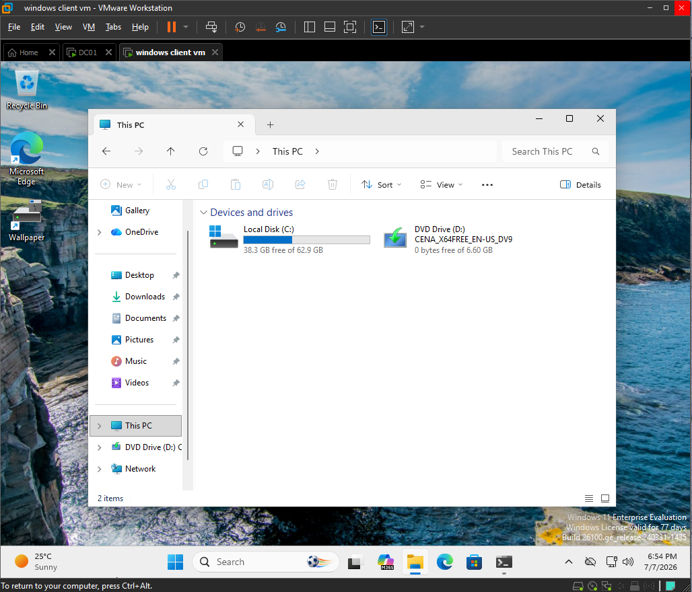
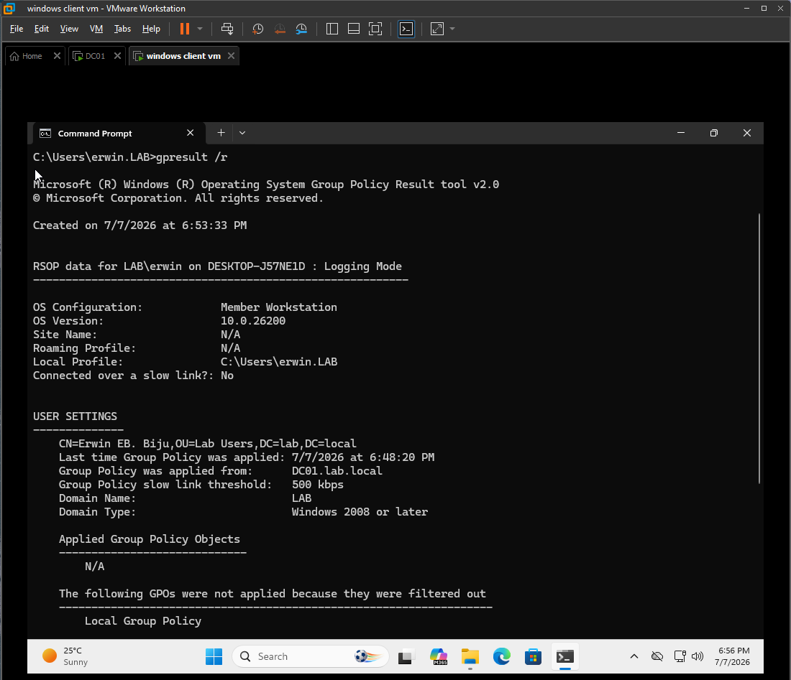
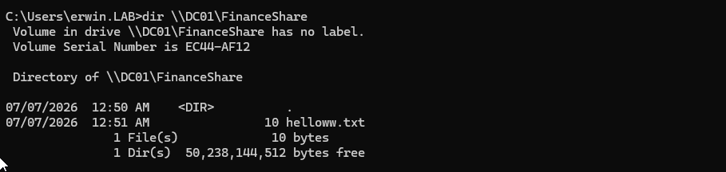
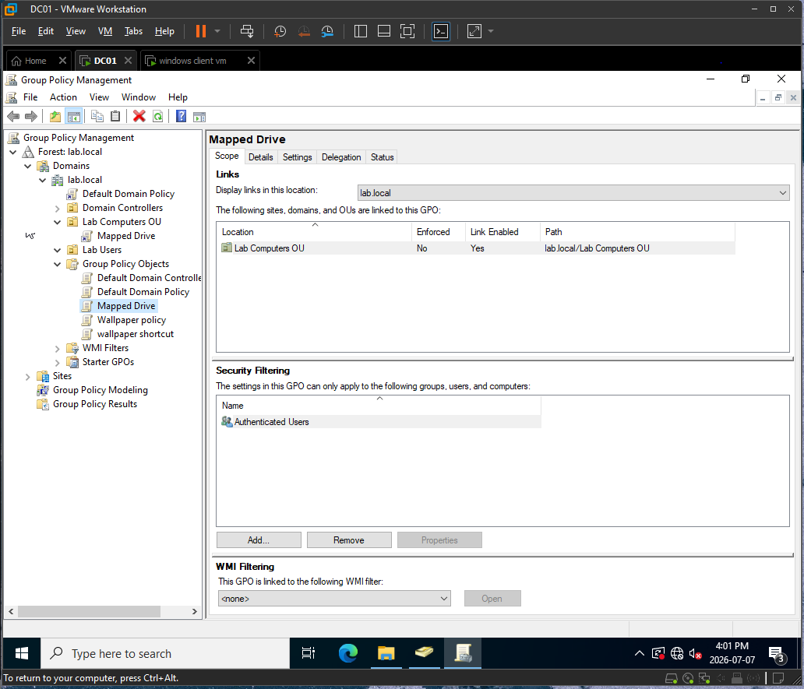
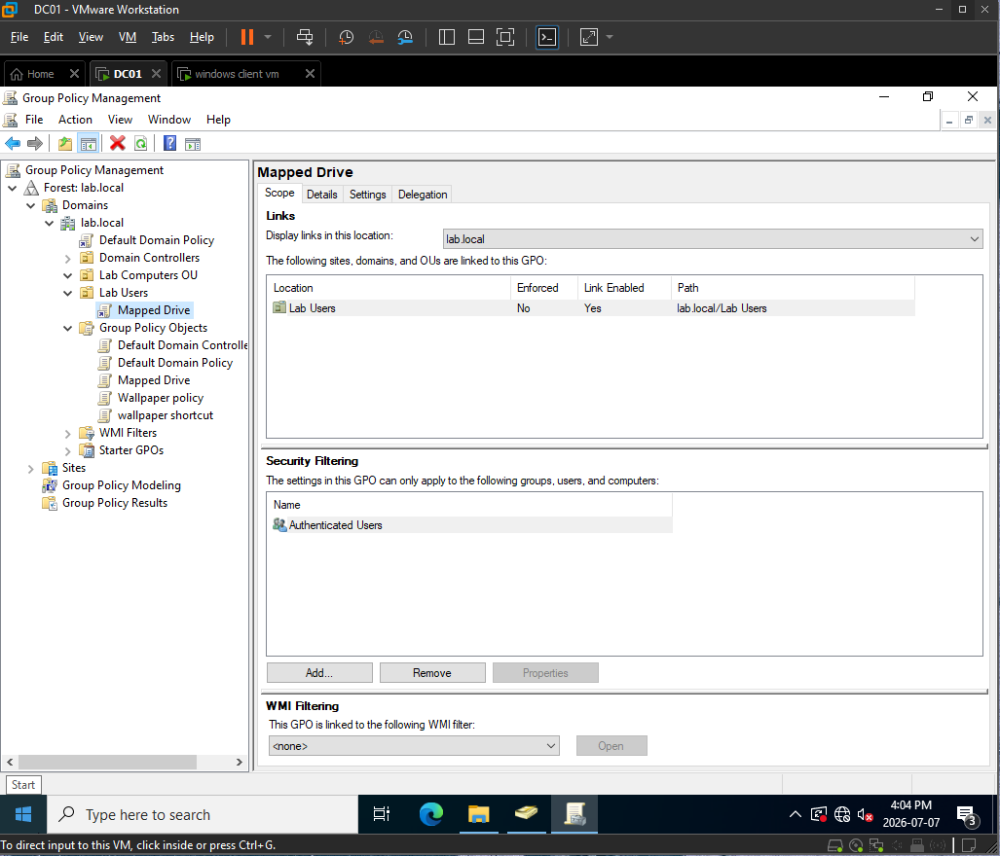
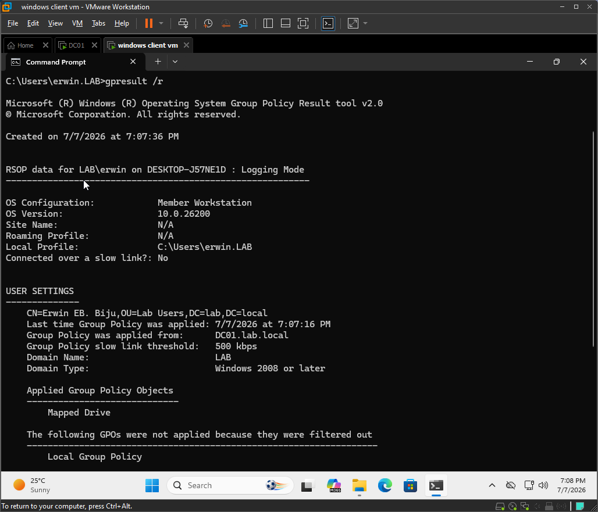
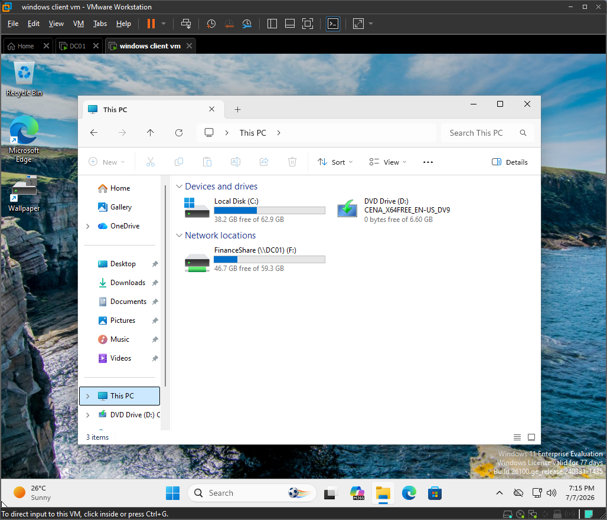
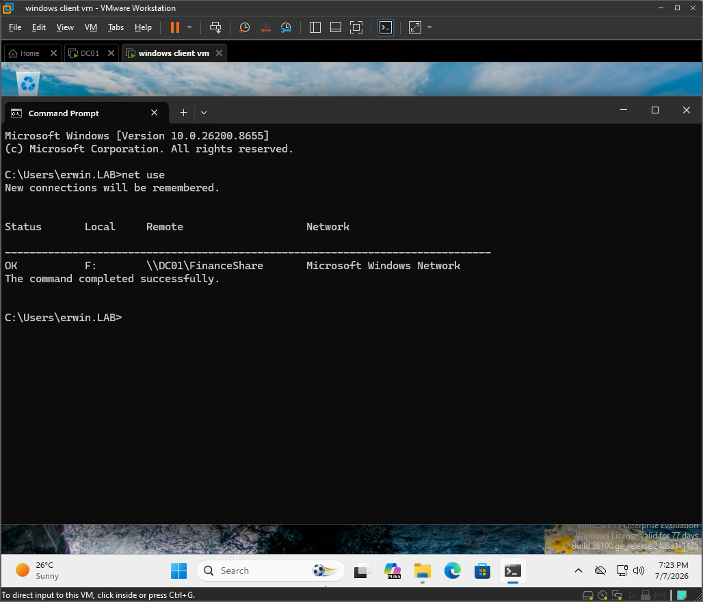

# Ticket 001: Mapped Drive Missing

## Issue Summary

A domain user reported that the expected Finance mapped drive did not appear after logging into the Windows client.

## Environment

| Item | Details |
|---|---|
| Domain | lab.local |
| NetBIOS | LAB |
| Domain Controller | DC01 |
| Domain Controller IP | 192.168.40.10 |
| Client | DESKTOP-J57NE1D |
| Client OS | Windows 11 Enterprise |
| User | LAB\erwin |
| Shared Folder | `\\DC01\FinanceShare` |
| Global Group | Finance-Users |
| Domain Local Group | Finance-Share-Read |
| Related GPO | Finance Mapped Drive Policy |

## Symptoms

- The Finance mapped drive did not appear in File Explorer after login.
- The user expected access to the Finance shared folder.
- Direct UNC access to `\\DC01\FinanceShare` worked.
- The issue affected drive mapping, not folder permissions.

## Troubleshooting Steps

### 1. Verified mapped drive was missing

I checked File Explorer on the Windows client and confirmed that the expected Finance mapped drive was not present.

Result:

The Finance mapped drive was missing after user login.

Evidence:



---

### 2. Checked applied Group Policy results

I checked which Group Policy Objects were applied to the logged-in user.

Command used:

```cmd
gpresult /r
```

Result:

The Finance mapped drive GPO was not listed under the applied user policies.

Evidence:



---

### 3. Verified direct UNC access

I tested direct access to the Finance shared folder using the UNC path.

Path tested:

```cmd
\\DC01\FinanceShare
```

Result:

The user was able to access the shared folder directly through the UNC path.

This proved that the share path, basic network connectivity, and folder permissions were working.

Evidence:



---

### 4. Checked GPO link location in Group Policy Management

On DC01, I opened Group Policy Management Console and checked where the Finance mapped drive GPO was linked.

Tool used:

```text
Group Policy Management Console
```

Result:

The Finance mapped drive GPO was linked to the wrong OU, so it did not apply to `LAB\erwin`.

Evidence:



## Root Cause

The Finance mapped drive GPO was linked to the wrong Organizational Unit.

The user account `LAB\erwin` was not in the OU where the Finance mapped drive policy was linked, so the user-side drive mapping preference did not apply during logon.

Because direct UNC access to `\\DC01\FinanceShare` worked, the shared folder and permissions were not the root cause. The issue was with Group Policy scope and linking.

## Fix

I linked the Finance mapped drive GPO to the correct OU containing the affected user account.

Fix performed:

```text
Linked Finance Mapped Drive Policy to the correct user OU.
```

Evidence:



## Verification

### 1. Confirmed the GPO applied

After correcting the GPO link, I refreshed Group Policy and checked the applied user policies again.

Command used:

```cmd
gpresult /r
```

Result:

The Finance mapped drive GPO appeared under the applied user policies.

Evidence:



---

### 2. Confirmed mapped drive appeared

After logging off and back on, I checked File Explorer again.

Result:

The Finance mapped drive appeared successfully.

Evidence:



---

### 3. Confirmed mapped drive connection with net use

I verified the mapped drive connection from Command Prompt.

Command used:

```cmd
net use
```

Result:

The Finance mapped drive was listed and connected to `\\DC01\FinanceShare`.

Evidence:



## Interview Explanation

In this ticket, the user could access `\\DC01\FinanceShare` directly, but the mapped drive did not appear after login. That told me the share itself was reachable and the permissions were likely correct.

I checked File Explorer to confirm the drive was missing, then checked applied Group Policy using `gpresult /r`. The Finance mapped drive GPO was not applying to the user.

I then checked Group Policy Management on DC01 and found that the GPO was linked to the wrong OU. Since GPOs only apply to users or computers within the linked scope, the mapped drive policy never applied to `LAB\erwin`.

I fixed the issue by linking the GPO to the correct OU, refreshing Group Policy, logging the user off and back on, and verifying that the mapped drive appeared successfully.

## Help Desk Notes

- Direct UNC access and mapped drive visibility are separate checks.
- If UNC access works but the mapped drive is missing, the issue is likely related to Group Policy, drive mapping configuration, or GPO scope.
- `gpresult /r` is useful for checking whether the expected user-side GPO applied.
- A GPO must be linked to the correct OU and must apply to the correct user or computer object.
- User Configuration settings apply based on the user object's OU location unless loopback processing is involved.
- For this lab, the correct share path is `\\DC01\FinanceShare`.
