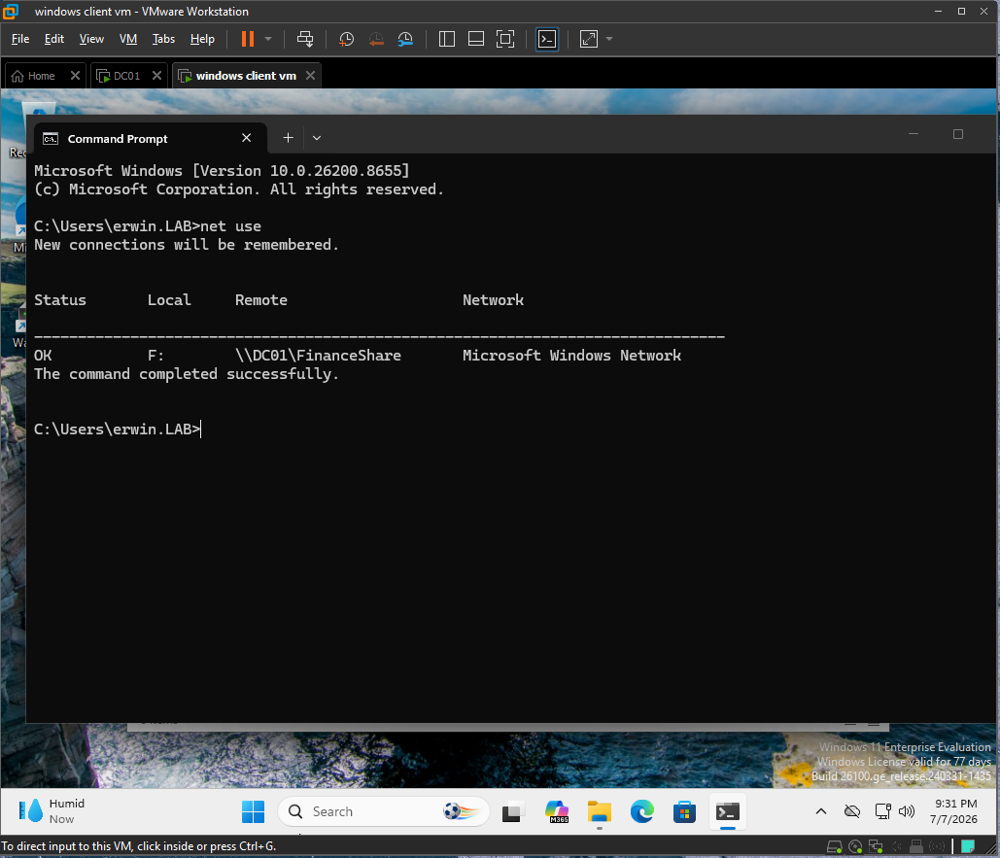
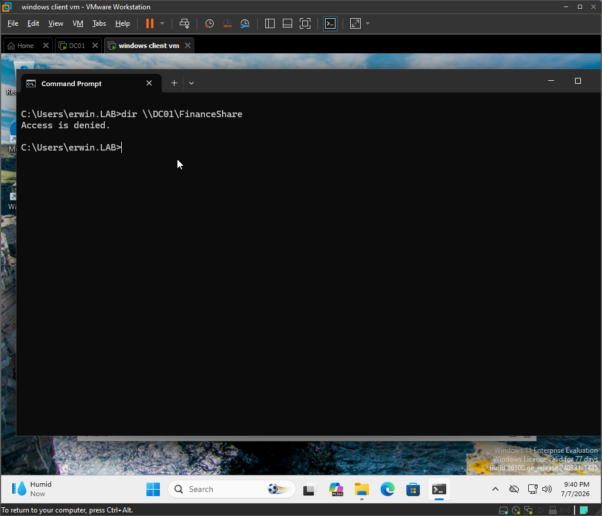
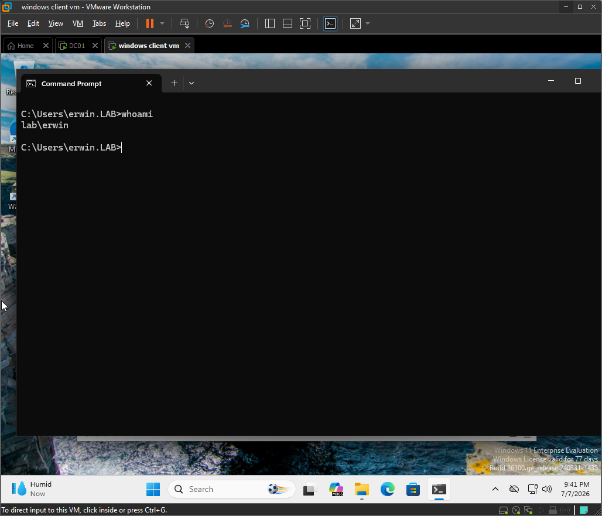
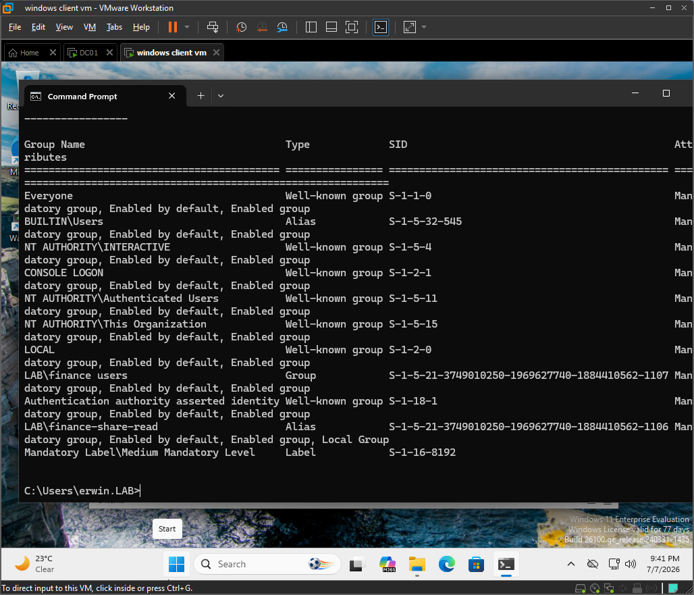
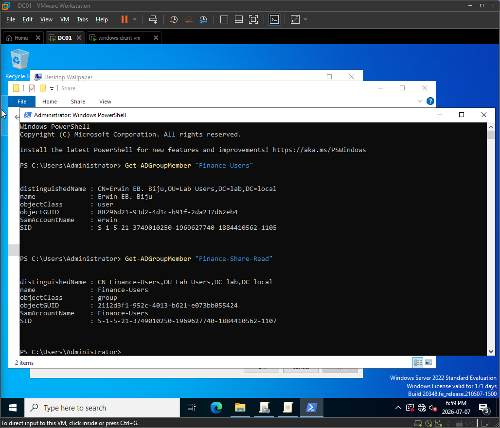
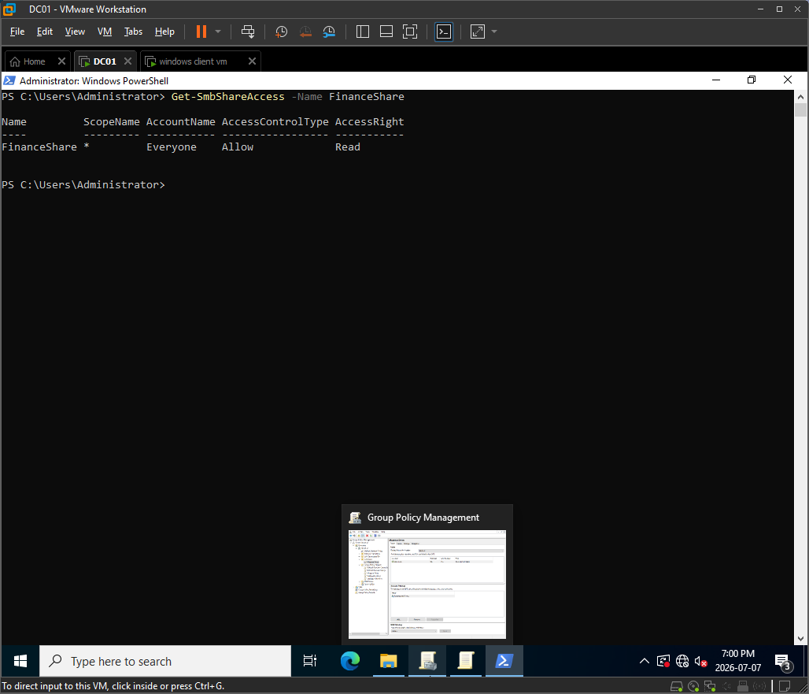
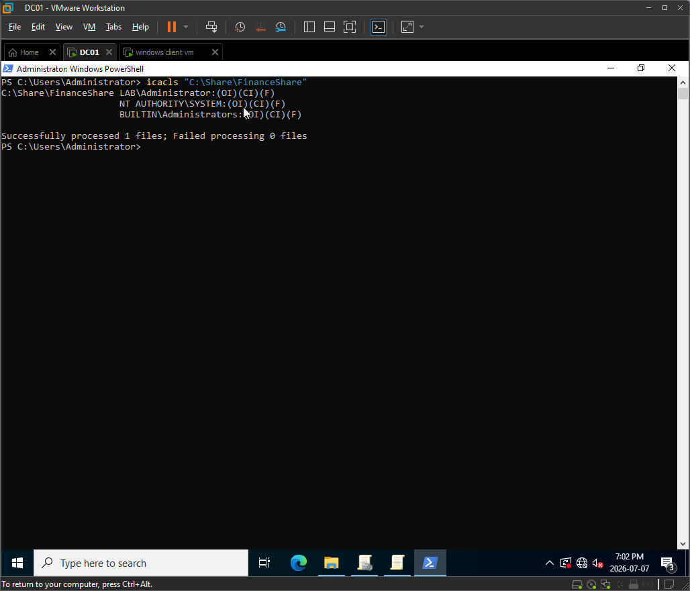
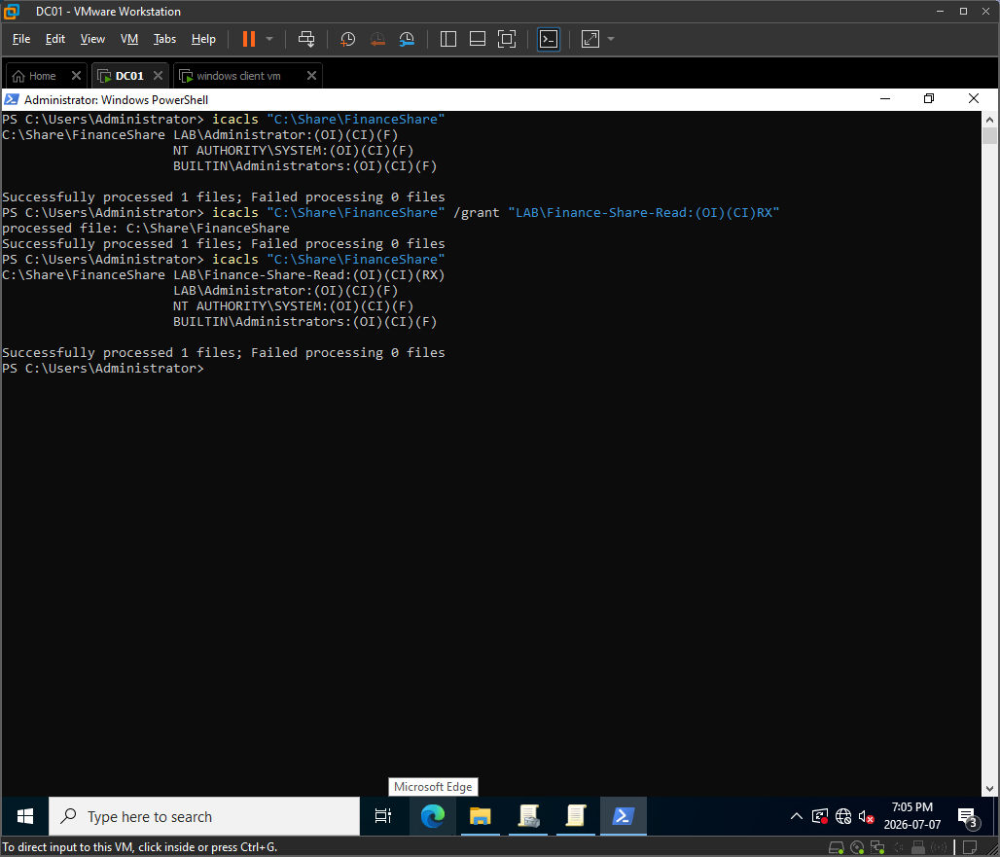
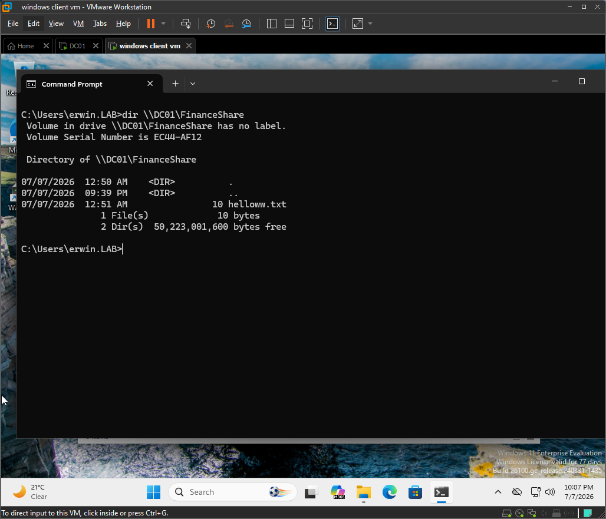
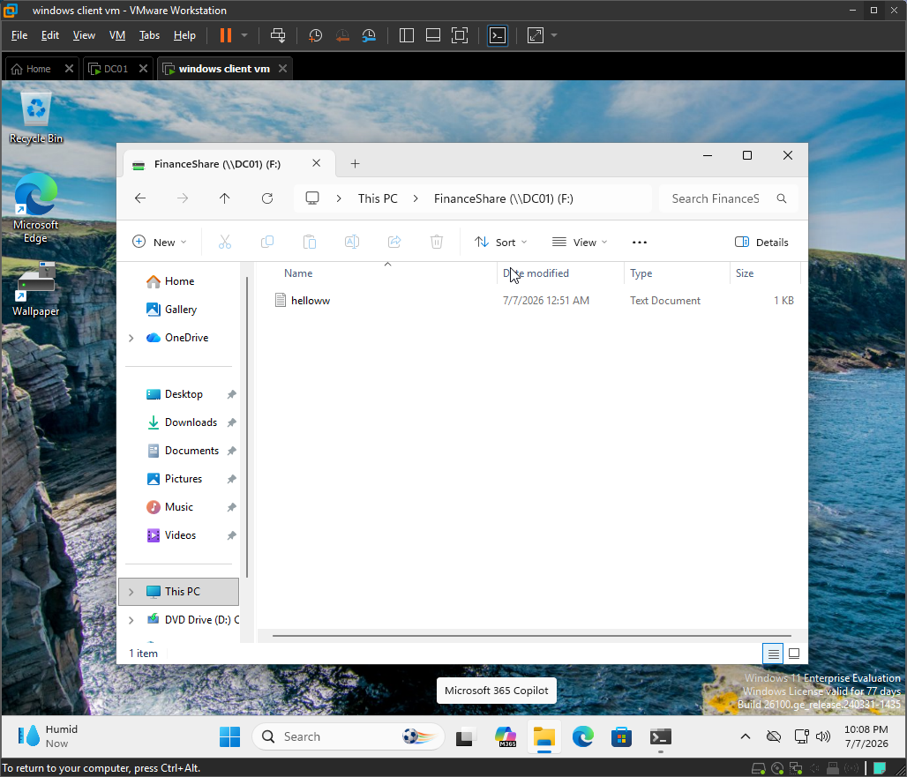

# Ticket 002: Access Denied to Shared Folder

## Issue Summary

A domain user reported that the Finance mapped drive appeared after logging into the Windows client, but opening the drive failed with an Access Denied error.

## Environment

| Item | Details |
|---|---|
| Domain | lab.local |
| NetBIOS | LAB |
| Domain Controller | DC01 |
| Client | DESKTOP-J57NE1D |
| Client OS | Windows 11 Enterprise |
| User | LAB\erwin |
| Shared Folder | `\\DC01\FinanceShare` |
| Global Group | Finance-Users |
| Domain Local Group | Finance-Share-Read |
| Related GPO | Finance Mapped Drive Policy |

## Symptoms

- Finance mapped drive appeared in File Explorer.
- Direct UNC access to `\\DC01\FinanceShare` failed.
- Command-line access to the UNC path returned Access Denied.
- The issue affected folder access, not drive mapping.

## Troubleshooting Steps

### 1. Verified mapped drive connection

I confirmed that the Finance mapped drive existed on the Windows client.

Command used:

```cmd
net use
```

Result:

The mapped drive was present, which showed that the drive mapping GPO was applying correctly.

Evidence:



---

### 2. Tested direct UNC access

I tested direct access to the shared folder using the UNC path.

Command used:

```cmd
dir \\DC01\FinanceShare
```

Result:

Access was denied.

Evidence:



---

### 3. Verified the logged-in user

I confirmed the active user session on the client.

Command used:

```cmd
whoami
```

Result:

The logged-in user was `LAB\erwin`.

Evidence:



---

### 4. Verified user group membership

I checked the user's current logon token for Finance-related group membership.

Command used:

```cmd
whoami /groups
```

Result:

The user had the expected Finance group membership for this access path.

Evidence:



---

### 5. Verified AGDLP group nesting

On DC01, I confirmed that the access model followed an AGDLP-style structure.

Commands used:

```powershell
Get-ADGroupMember "Finance-Users"
```

```powershell
Get-ADGroupMember "Finance-Share-Read" 
```

Result:

`LAB\erwin` was a member of the `Finance-Users` global group, and `Finance-Users` was nested inside the `Finance-Share-Read` domain local group.

Evidence:



---

### 6. Checked SMB share permissions

On DC01, I checked the SMB share permissions for the Finance share.

Command used:

```powershell
Get-SmbShareAccess -Name FinanceShare
```

Result:

The SMB share existed and the share permission layer was not identified as the root cause.

Evidence:



---

### 7. Checked NTFS permissions

On DC01, I checked the NTFS permissions on the actual folder backing the share.

Command used:

```cmd
icacls "C:\Shares\FinanceShare"
```

Result:

The `LAB\Finance-Share-Read` domain local group did not have the required NTFS permission on the folder.

Evidence:



## Root Cause

The mapped drive GPO was working and the Active Directory group nesting was correct.

`LAB\erwin` was a member of the `Finance-Users` global group, and `Finance-Users` was nested inside the `Finance-Share-Read` domain local group.

However, the `Finance-Share-Read` domain local group was missing the required NTFS permission on the folder backing `\\DC01\FinanceShare`.

Because Windows file access requires the user to be allowed through both the SMB share permission layer and the NTFS permission layer, access was denied even though the mapped drive appeared.

## Fix

I restored the required NTFS permission for the domain local group assigned to the Finance share.

Command used:

```cmd
icacls "C:\Shares\FinanceShare" /grant "LAB\Finance-Share-Read:(OI)(CI)RX"
```

Permission restored:

```text
LAB\Finance-Share-Read = Read & Execute
```

Evidence:



## Verification

After restoring the NTFS permission, I tested access again from the Windows client.

Command used:

```cmd
dir \\DC01\FinanceShare
```

Result:

The user was able to access the shared folder successfully.

Evidence:



I also confirmed access through File Explorer using the mapped Finance drive.

Evidence:



## Explanation

In this ticket, the mapped drive appeared, so I knew the Group Policy drive mapping was working. The user still received Access Denied when opening the share, so I focused on file access permissions.

The lab used an AGDLP-style permission model. The user account was placed in the `Finance-Users` global group, that global group was nested inside the `Finance-Share-Read` domain local group, and the domain local group was supposed to be assigned permissions on the shared folder.

I verified the user identity, global group membership, group nesting, share permissions, and NTFS permissions. The root cause was that the `Finance-Share-Read` domain local group was missing the required NTFS permission on the folder backing `\\DC01\FinanceShare`.

I fixed the issue by restoring NTFS Read & Execute permission for `LAB\Finance-Share-Read`, then verified that the user could access the share successfully.

## Help Desk Notes

- Drive mapping and folder access are separate layers.
- A mapped drive can appear even if the user does not have NTFS permission to open the folder.
- Windows file share access depends on both SMB share permissions and NTFS permissions.
- The effective access is the most restrictive result between share permissions and NTFS permissions.
- In an AGDLP model, users go into global groups, global groups go into domain local groups, and permissions are assigned to domain local groups.
- For this lab, permissions should be assigned to `Finance-Share-Read`, not directly to `Finance-Users`.
