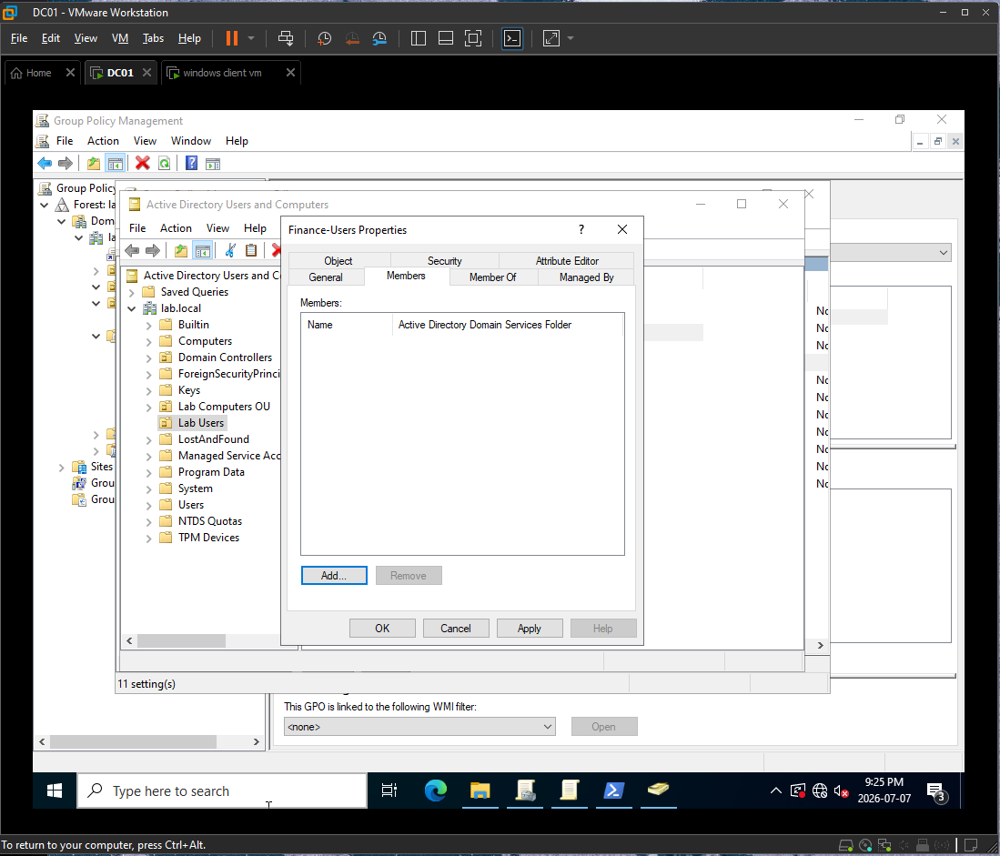
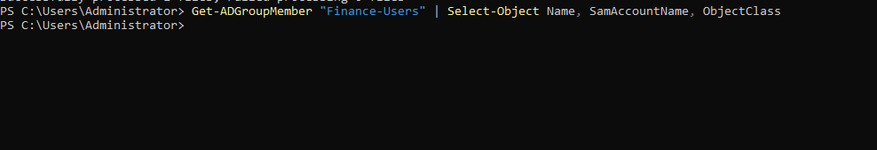
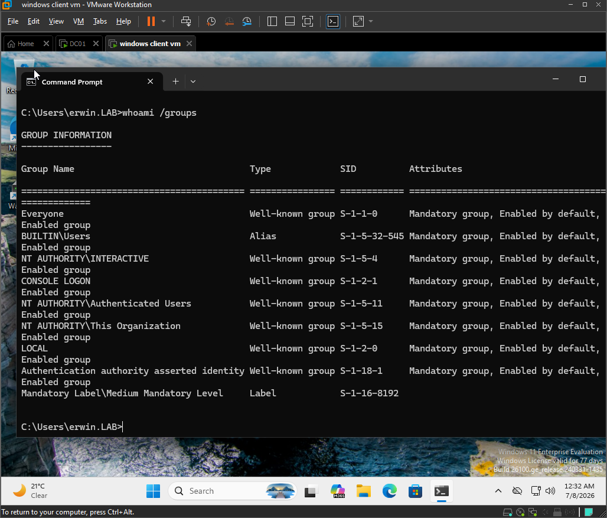
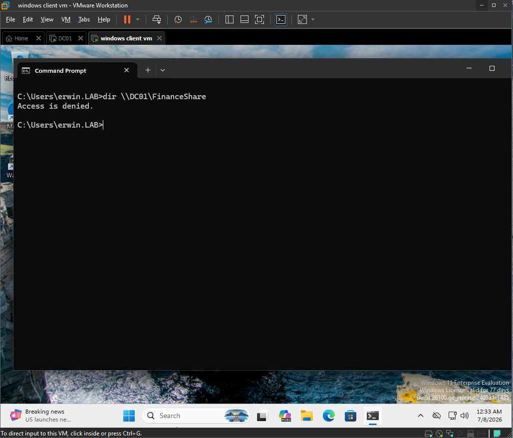
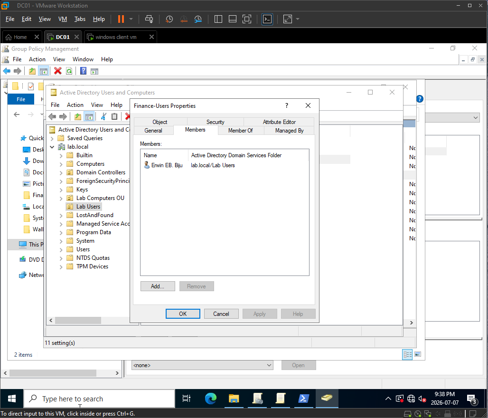
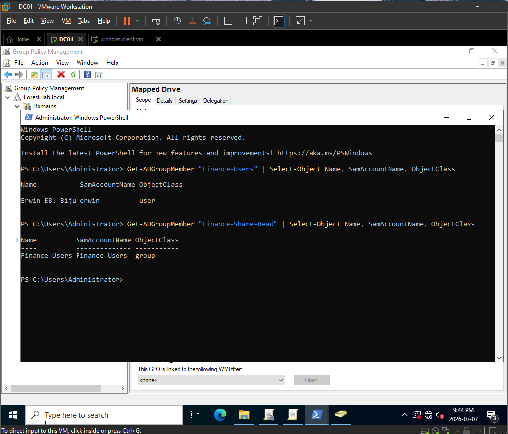
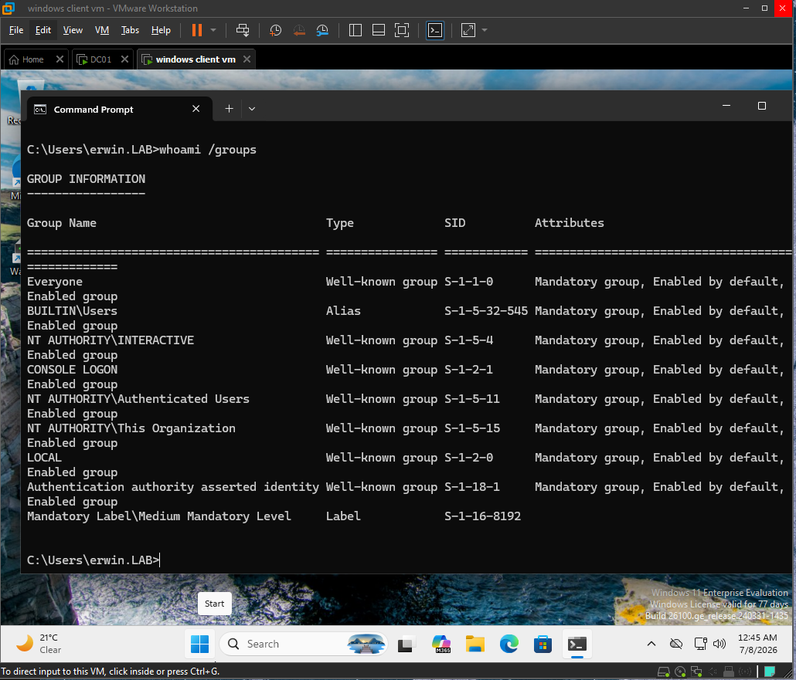
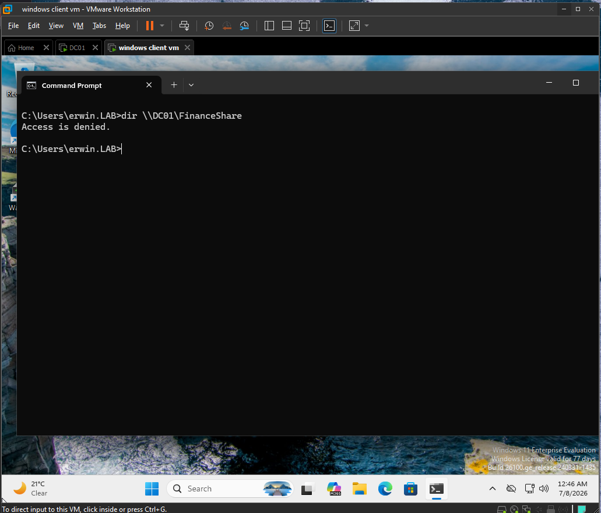
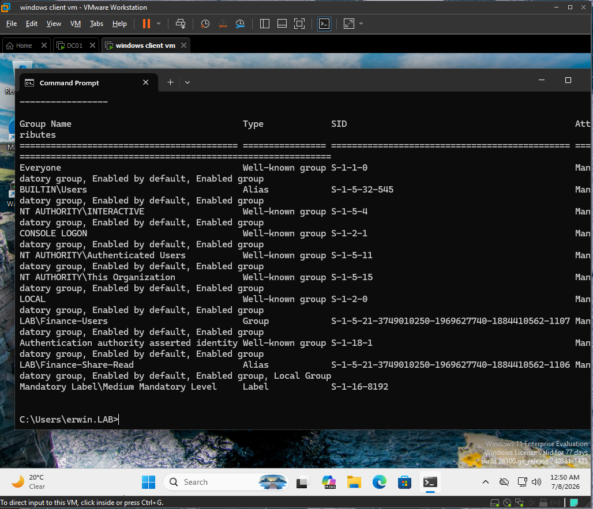
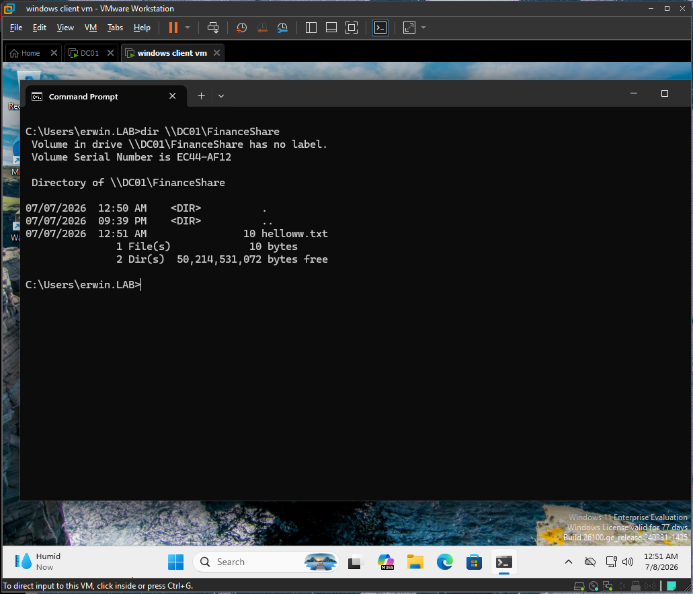

# Ticket 003: User Added to Group But Still Access Denied

## Issue Summary

A domain user was added to the correct Finance access group, but the user still received Access Denied when trying to access the Finance shared folder from the current Windows session.

## Environment

| Item | Details |
|---|---|
| Domain | lab.local |
| NetBIOS | LAB |
| Domain Controller | DC01 |
| Client | DESKTOP-J57NE1D |
| Client OS | Windows 11 Enterprise |
| User | LAB\erwin |
| Shared Folder | `\\DC01\FinanceShare` |
| Global Group | Finance-Users |
| Domain Local Group | Finance-Share-Read |
| Permission Model | AGDLP |

## Symptoms

- User could not access `\\DC01\FinanceShare`.
- Access failed with Access Denied.
- The user had been added to the correct AD group.
- The current Windows session still did not reflect the updated group membership.

## Troubleshooting Steps

### 1. Removed the user from the Finance global group using GUI

On DC01, I used Active Directory Users and Computers to remove `LAB\erwin` from the `Finance-Users` global group.

Tool used:

```text
Active Directory Users and Computers
```

Action performed:

```text
Finance-Users > Properties > Members > Remove LAB\erwin
```

Evidence:



---

### 2. Verified the user was removed from the group

On DC01, I verified the group membership using PowerShell.

Command used:

```powershell
Get-ADGroupMember "Finance-Users" | Select-Object Name, SamAccountName, ObjectClass
```

Result:

`LAB\erwin` was not listed as a member of `Finance-Users`.

Evidence:



---

### 3. Checked the user's current group membership on the client

After signing in as `LAB\erwin`, I checked the groups included in the user's current logon session.

Command used:

```cmd
whoami /groups
```

Result:

The Finance access groups were not present in the current user token.

Evidence:



---

### 4. Tested access to the Finance share

I tested direct UNC access to the Finance shared folder.

Command used:

```cmd
dir \\DC01\FinanceShare
```

Result:

Access was denied.

Evidence:



---

### 5. Added the user back to the Finance global group using GUI

On DC01, I used Active Directory Users and Computers to add `LAB\erwin` back to the `Finance-Users` global group.

Tool used:

```text
Active Directory Users and Computers
```

Action performed:

```text
Finance-Users > Properties > Members > Add LAB\erwin
```

Evidence:



---

### 6. Verified Active Directory group membership was correct

On DC01, I verified that `LAB\erwin` was listed in `Finance-Users`.

Command used:

```powershell
Get-ADGroupMember "Finance-Users" | Select-Object Name, SamAccountName, ObjectClass
```

I also verified that the AGDLP nesting was still correct.

Command used:

```powershell
Get-ADGroupMember "Finance-Share-Read" | Select-Object Name, SamAccountName, ObjectClass
```

Result:

`LAB\erwin` was a member of `Finance-Users`, and `Finance-Users` was nested inside `Finance-Share-Read`.

Evidence:



---

### 7. Verified the current client session was still stale

Without signing out, I checked the user's current group membership again on the client.

Command used:

```cmd
whoami /groups
```

Result:

The current logon session still did not show the updated Finance group membership.

Evidence:



---

### 8. Confirmed access still failed from the stale session

While still using the same logged-in session, I tested access to the Finance share again.

Command used:

```cmd
dir \\DC01\FinanceShare
```

Result:

Access was still denied.

Evidence:



## Root Cause

The user was added back to the correct Active Directory group, but the current Windows logon session did not contain the updated group membership.

Windows creates a user access token at logon. That token contains the user's security identifiers and group memberships at the time of sign-in. Because `LAB\erwin` was already logged in before being added back to `Finance-Users`, the current session did not immediately receive the updated Finance group membership.

The issue was not caused by the SMB share path, NTFS permissions, or GPO drive mapping. The issue was caused by a stale logon session.

## Fix

I signed the user out and signed back in so Windows could create a new logon session with the updated group membership.

Fix performed:

```text
Signed out LAB\erwin and signed back in.
```

## Verification

### 1. Confirmed updated group membership after signing back in

After signing back in, I checked the user's group membership again.

Command used:

```cmd
whoami /groups
```

Result:

The updated Finance group membership appeared in the user's current session.

Evidence:



---

### 2. Confirmed access to the Finance share

I tested access to the Finance shared folder again.

Command used:

```cmd
dir \\DC01\FinanceShare
```

Result:

The user was able to access `\\DC01\FinanceShare` successfully.

Evidence:



## Explanation

In this ticket, the user had been added to the correct Active Directory group but still received Access Denied from the current Windows session.

I verified the user's group membership in Active Directory and confirmed that the access model was correct: `LAB\erwin` was added to the `Finance-Users` global group, and `Finance-Users` was nested inside the `Finance-Share-Read` domain local group.

The problem was that the user was already logged in before the group membership change. Windows creates the user's access token at logon, so the current session did not immediately contain the new group membership. I fixed the issue by signing the user out and back in, then verified that the new group membership appeared in `whoami /groups` and that access to `\\DC01\FinanceShare` worked.

## Help Desk Notes

- Adding a user to an AD group does not always affect the user's current logon session immediately.
- The user may need to sign out and sign back in to receive a new access token.
- `whoami /groups` shows the groups available in the current user session.
- Checking AD group membership alone is not enough; the current client session must also be checked.
- `gpupdate /force` refreshes Group Policy, but it does not rebuild the user's access token.
- In an AGDLP model, users go into global groups, global groups go into domain local groups, and permissions are assigned to domain local groups.
- For this lab, `Finance-Users` is nested inside `Finance-Share-Read`, and `Finance-Share-Read` has access to `\\DC01\FinanceShare`.
