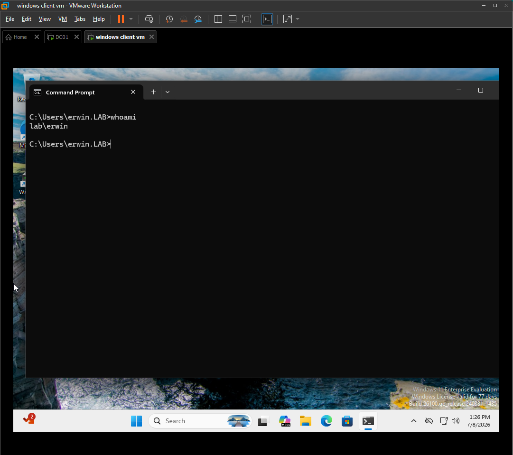
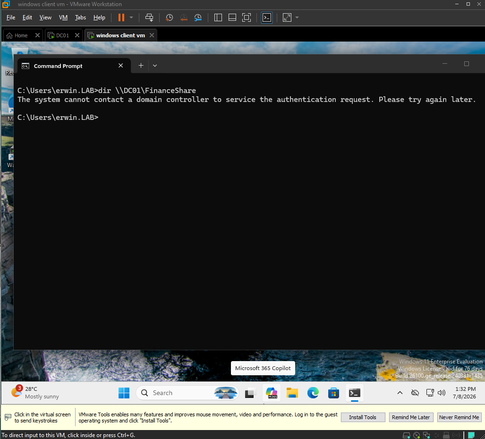
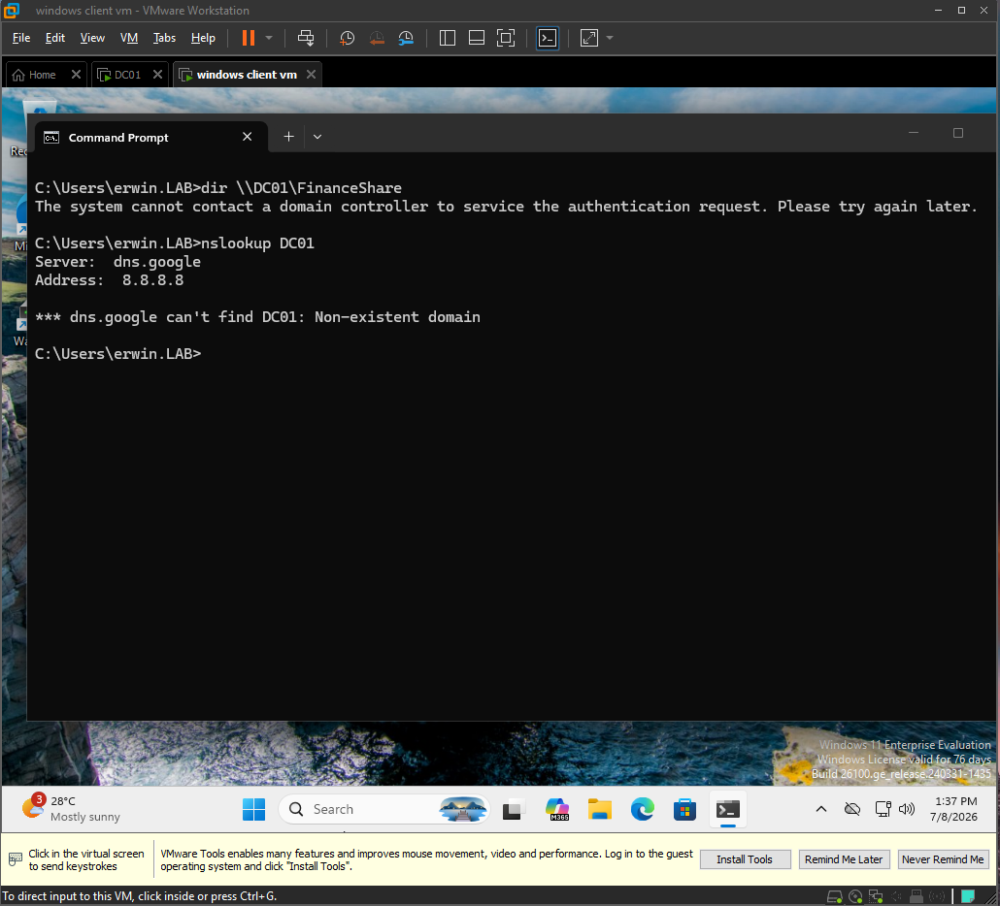
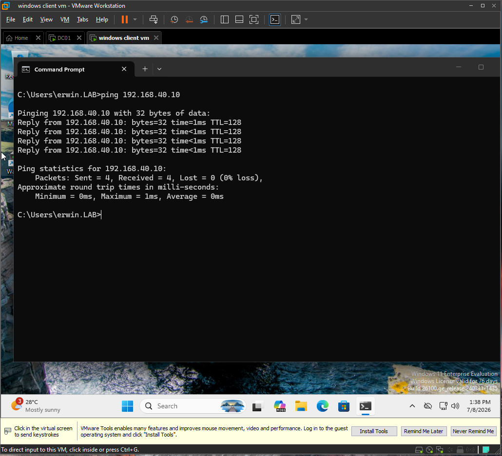
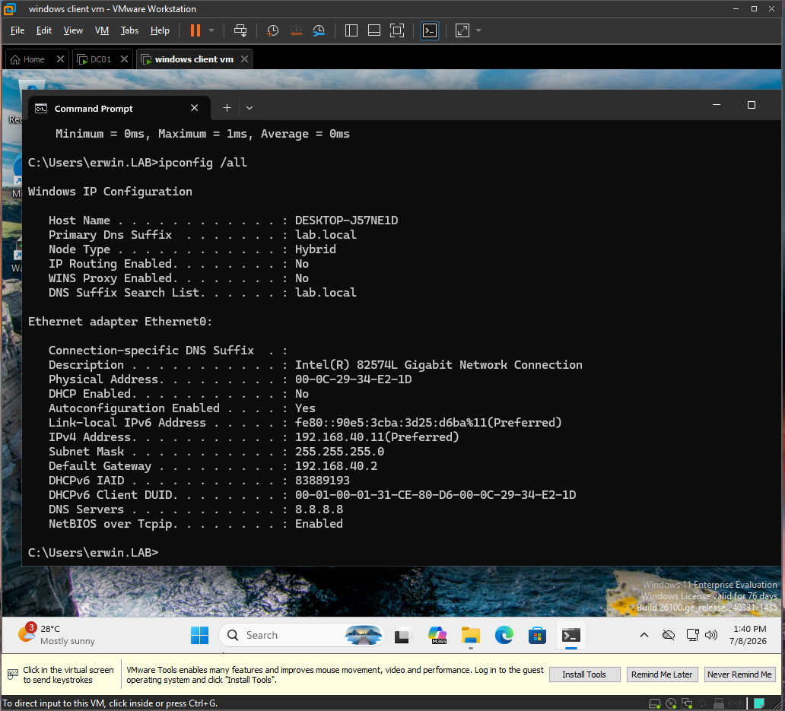
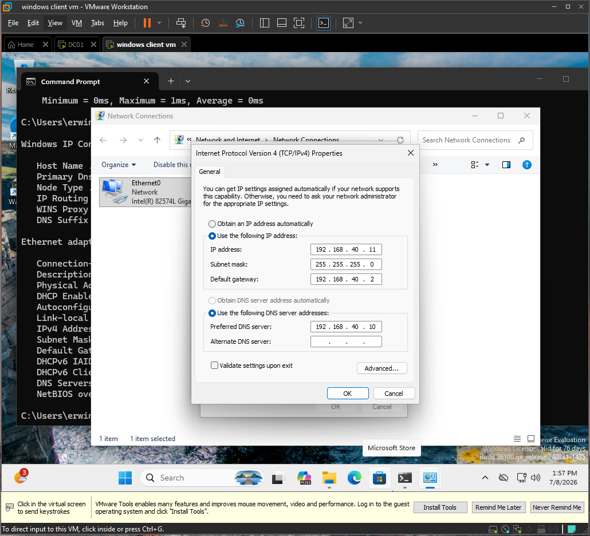
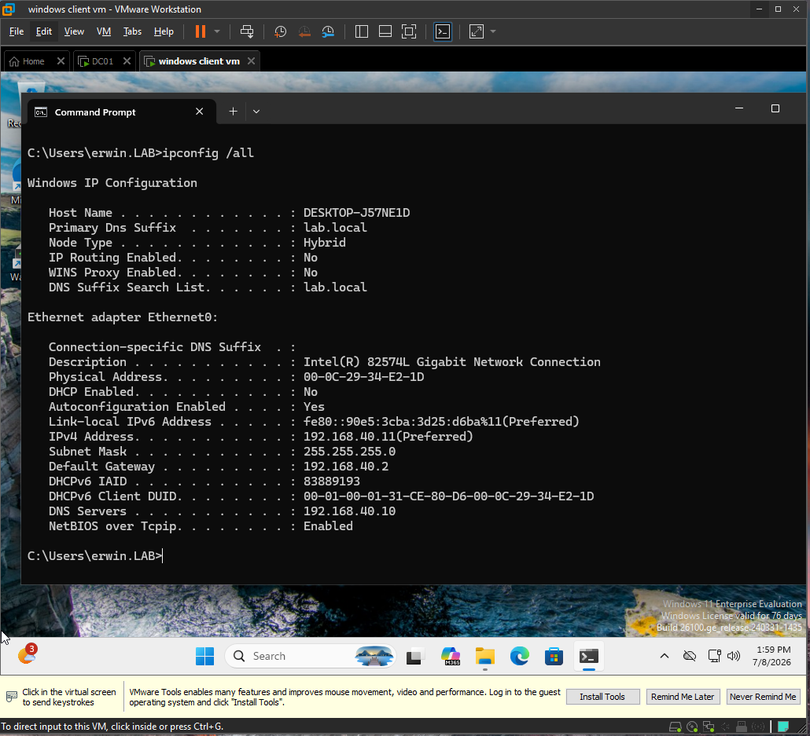
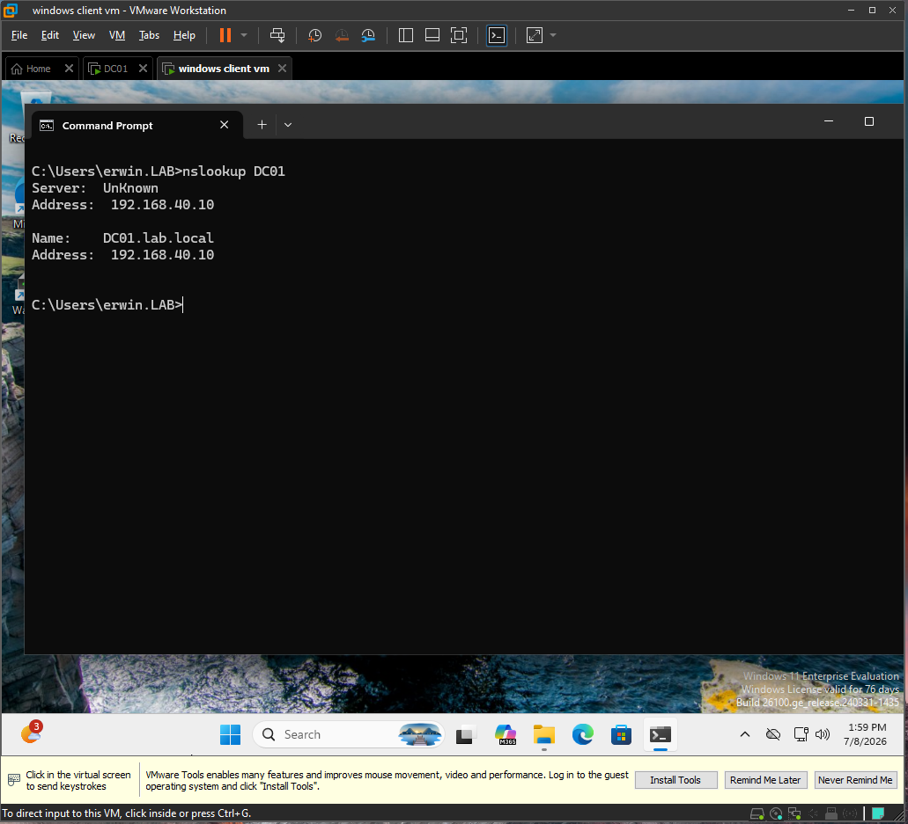
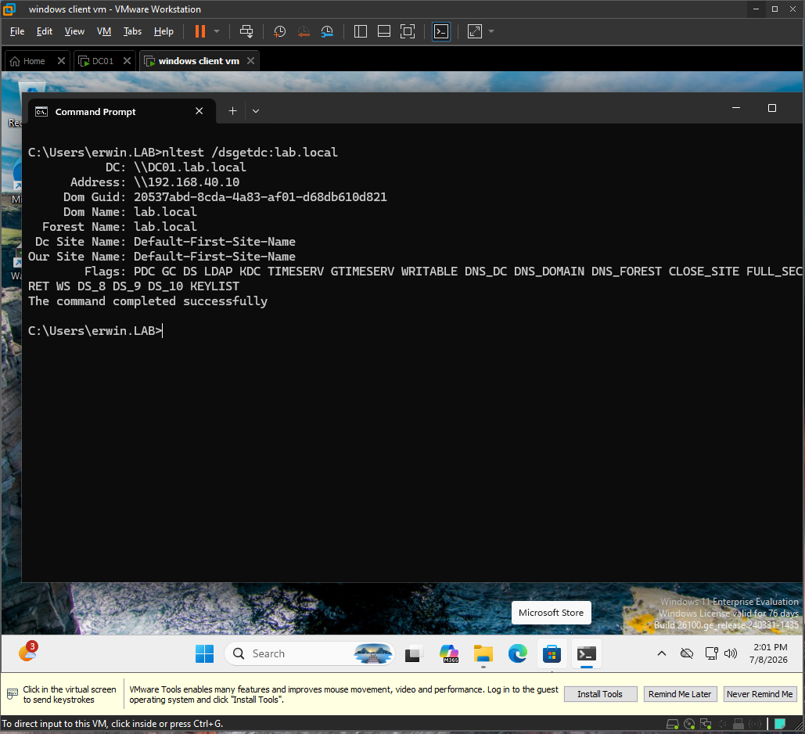
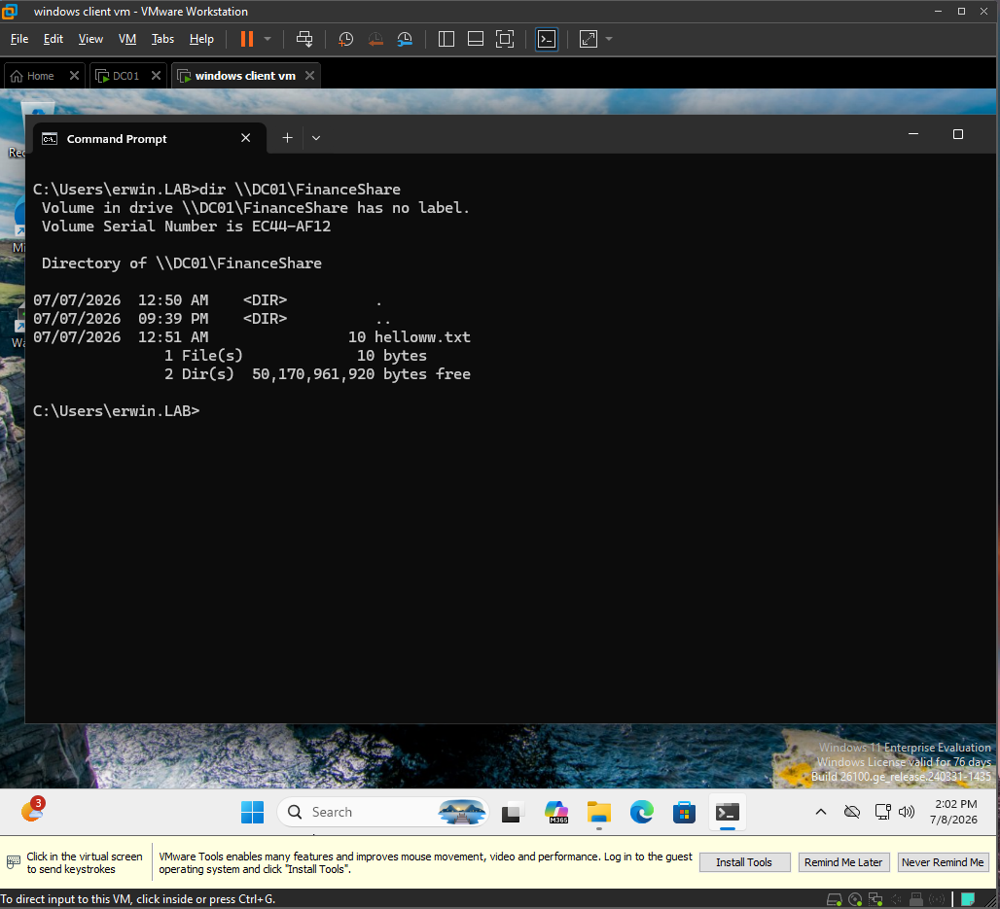

# Ticket 004: Domain Resources Unavailable Due to Wrong DNS Server

## Issue Summary

A domain user reported that they could not access the Finance shared folder using the normal UNC path:

`\\DC01\FinanceShare`

The client was still connected to the network, but domain resources were unavailable by name. Investigation showed that the Windows client was configured to use an incorrect DNS server instead of the Active Directory DNS server on the domain controller.

## Environment

| Item                | Details               |
| ------------------- | --------------------- |
| Domain              | lab.local             |
| NetBIOS             | LAB                   |
| Domain Controller   | DC01                  |
| DC IP Address       | 192.168.40.10         |
| Server OS           | Windows Server 2022   |
| Client              | DESKTOP-J57NE1D       |
| Client OS           | Windows 11 Enterprise |
| User                | LAB\erwin             |
| Share Path          | \DC01\FinanceShare    |
| Expected DNS Server | 192.168.40.10         |

## Symptoms

* User could not access `\\DC01\FinanceShare`.
* The client could not resolve `DC01` correctly.
* The domain controller IP address was reachable.
* DNS configuration on the client was incorrect.
* The issue affected domain resource access by hostname.

## Troubleshooting Steps

### 1. Confirmed the logged-in user

I first confirmed that the test was being performed as the affected domain user.



The command confirmed that the active user session was:

`LAB\erwin`

---

### 2. Confirmed access failure to the Finance share

I tested access to the Finance shared folder using the standard UNC path.



Access to `\\DC01\FinanceShare` failed, which confirmed the reported issue.

---

### 3. Tested name resolution for DC01

I used `nslookup` to test whether the client could resolve the domain controller hostname.



The lookup failed or queried the wrong DNS server, which indicated a DNS/name resolution issue.

---

### 4. Verified network connectivity to the domain controller IP

I tested direct IP connectivity to the domain controller.



The ping to `192.168.40.10` succeeded. This proved that the client could reach the domain controller over the network.

Because IP connectivity worked but hostname resolution failed, the issue was likely DNS-related rather than a basic network connectivity problem.

---

### 5. Checked the client DNS configuration

I reviewed the client network configuration.



The client was configured to use the wrong DNS server instead of the domain controller DNS server.

Expected DNS server:

`192.168.40.10`

Incorrect DNS configuration prevented the client from resolving internal AD DS records and domain resources.

---

## Root Cause

The Windows client was configured with an incorrect DNS server.

In an Active Directory environment, domain-joined clients must use the AD-integrated DNS server. In this lab, the correct DNS server is the domain controller:

`192.168.40.10`

Because the client was using the wrong DNS server, it could not reliably resolve internal domain names such as:

* `DC01`
* `lab.local`
* AD DS service records used for domain controller discovery

As a result, access to `\\DC01\FinanceShare` failed by hostname.

## Fix

I corrected the client IPv4 DNS configuration using the Windows network adapter GUI.

The preferred DNS server was changed back to:

`192.168.40.10`



After correcting the DNS setting, I flushed the DNS cache with:

```cmd
ipconfig /flushdns
```

## Verification

### 1. Verified correct DNS server

I confirmed that the client was now using the domain controller as its DNS server.



The client now showed:

`DNS Server: 192.168.40.10`

---

### 2. Verified DC01 name resolution

I tested hostname resolution again.



`DC01` resolved successfully using the correct DNS server.

---

### 3. Verified domain controller discovery

I confirmed that the client could locate a domain controller for `lab.local`.



The command completed successfully and returned `DC01` as the domain controller.

---

### 4. Verified Finance share access

I tested access to the Finance share again.



The client successfully accessed:

`\\DC01\FinanceShare`

This confirmed that correcting DNS restored access to the domain resource.

## Explanation

In an Active Directory environment, domain-joined clients should use the domain controller or another AD-integrated DNS server for DNS resolution.

AD DS depends heavily on DNS. Clients use DNS not only to resolve server names like `DC01`, but also to locate domain controllers through AD service records. If a client is configured to use an external DNS server, it may still have network connectivity, but it will not be able to properly resolve internal domain resources.

In this ticket, the client could reach the domain controller IP address, but it could not resolve the domain controller hostname. That proved the network path was working and narrowed the issue to DNS. After setting the client DNS server back to `192.168.40.10`, name resolution, domain controller discovery, and Finance share access all worked again.

## Help Desk Notes

* Verified the issue as the affected user.
* Confirmed that access to `\\DC01\FinanceShare` failed.
* Confirmed that the domain controller IP was reachable.
* Identified incorrect DNS configuration on the client.
* Corrected the client DNS server to `192.168.40.10`.
* Flushed DNS cache.
* Verified `DC01` name resolution.
* Verified domain controller discovery with `nltest`.
* Verified successful access to the Finance share.
* Root cause: client was using the wrong DNS server.

