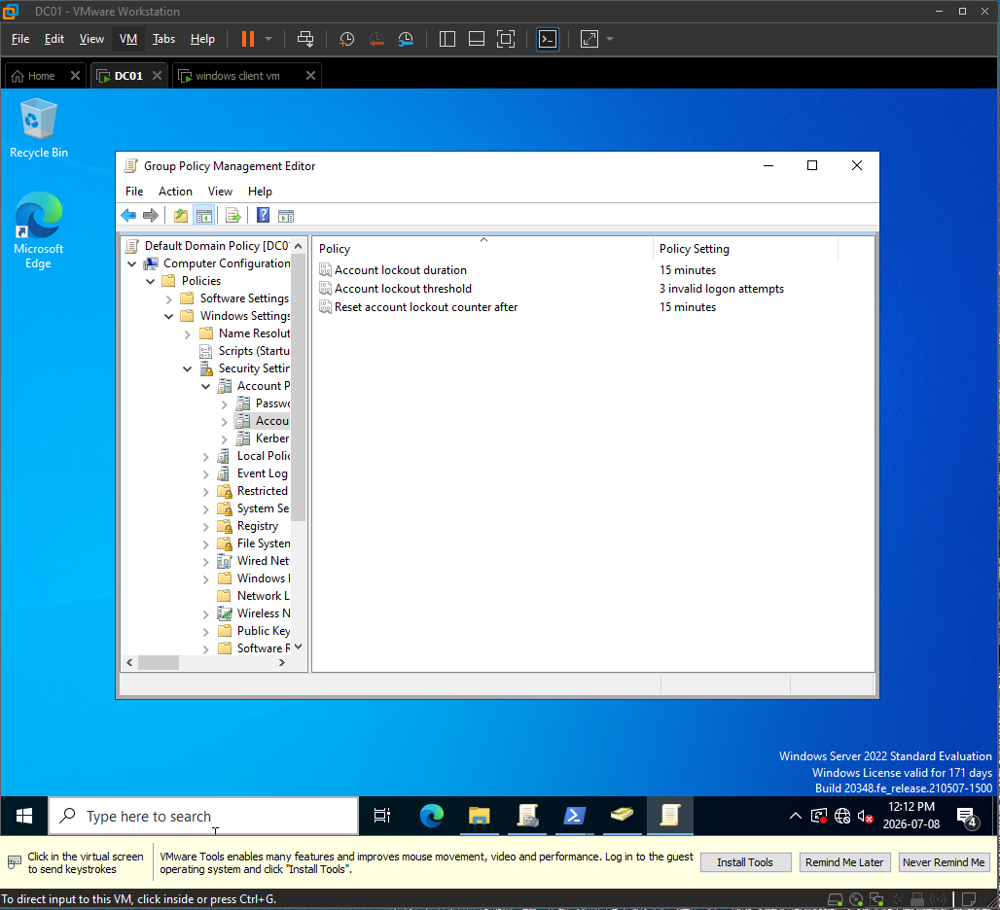
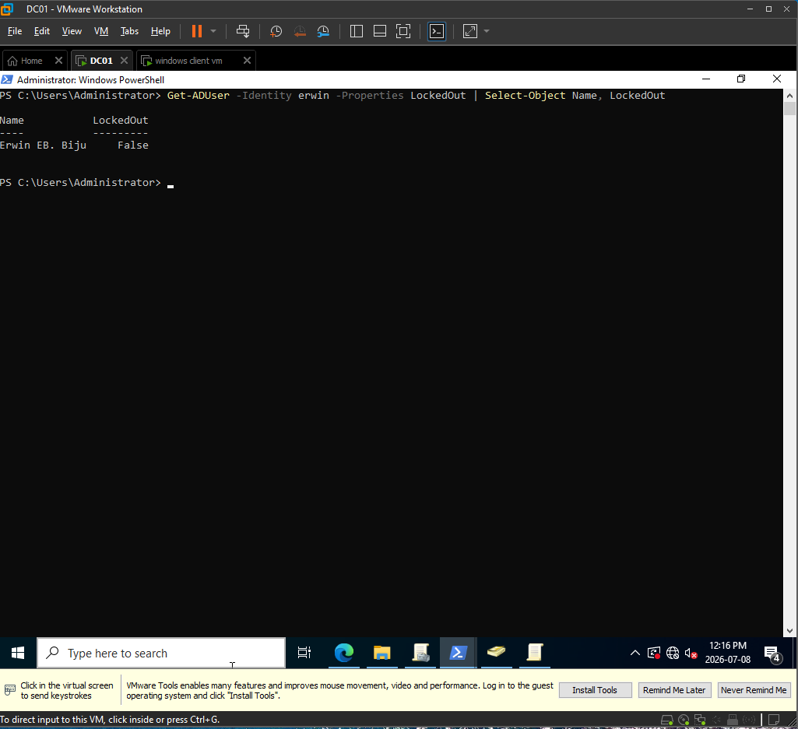
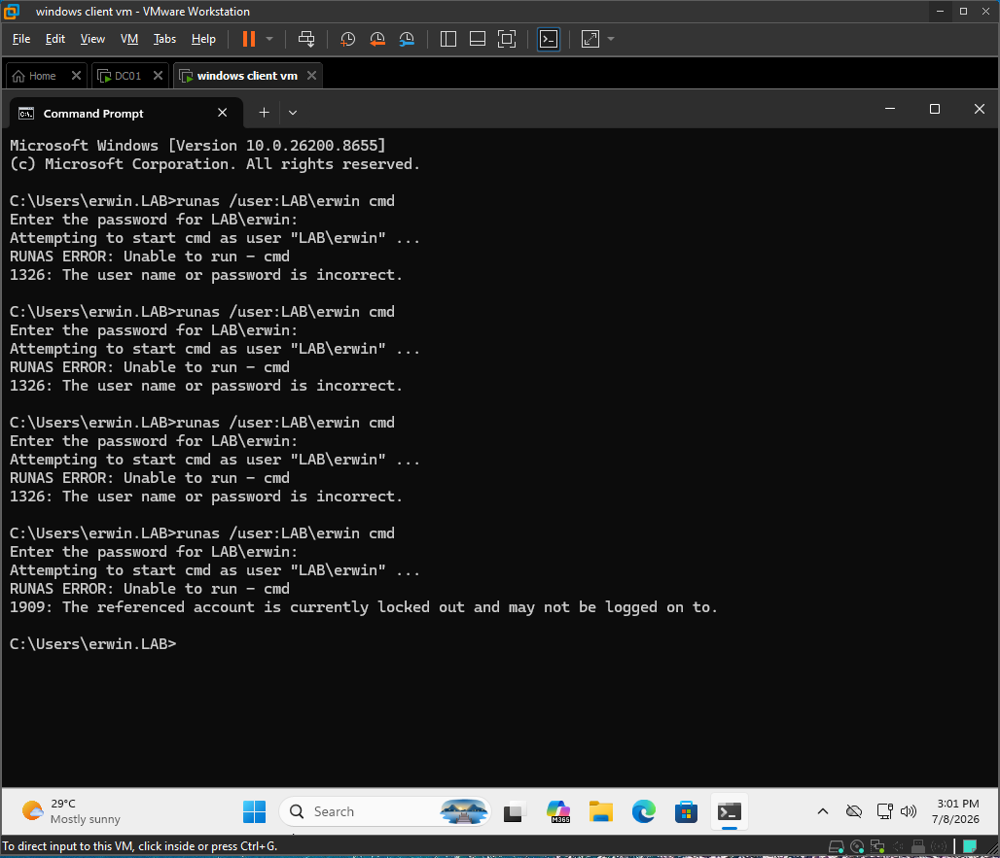
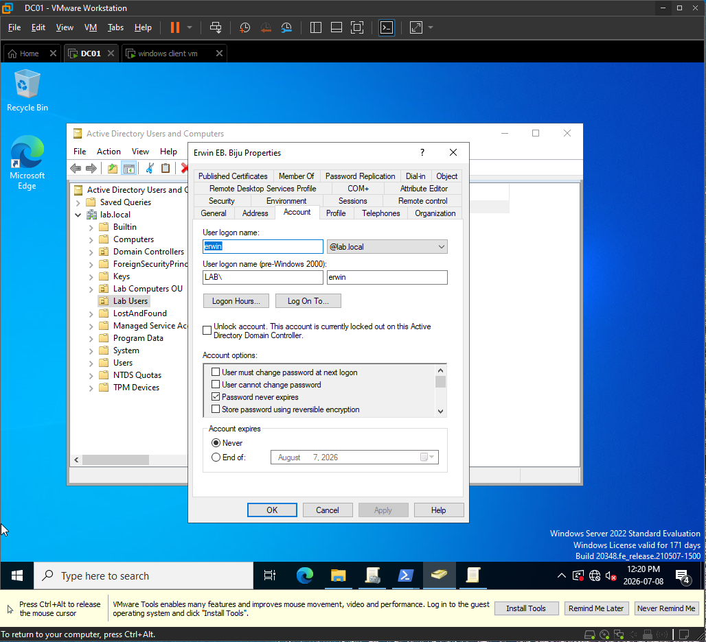
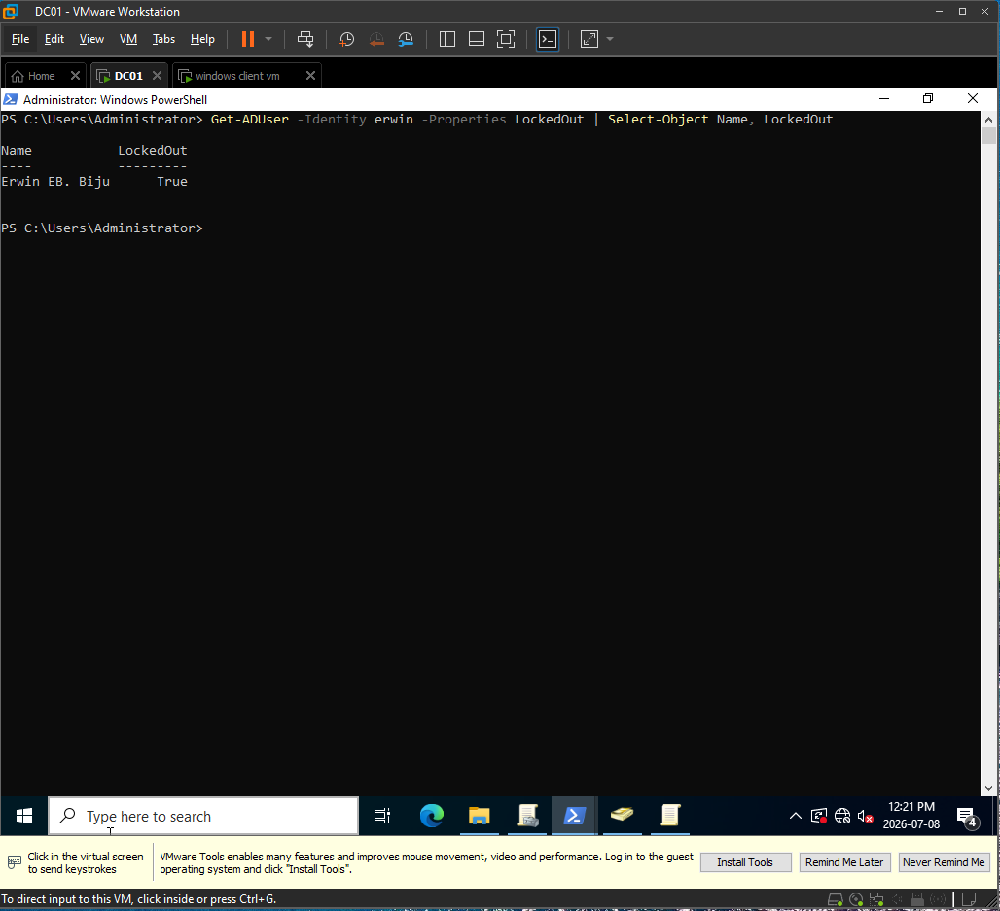
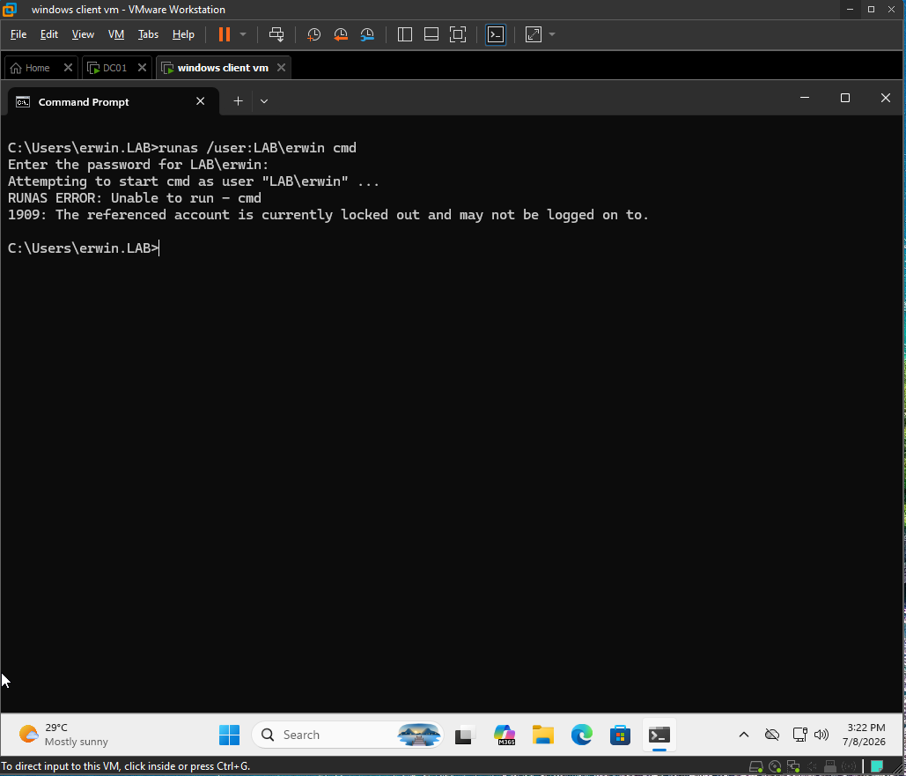
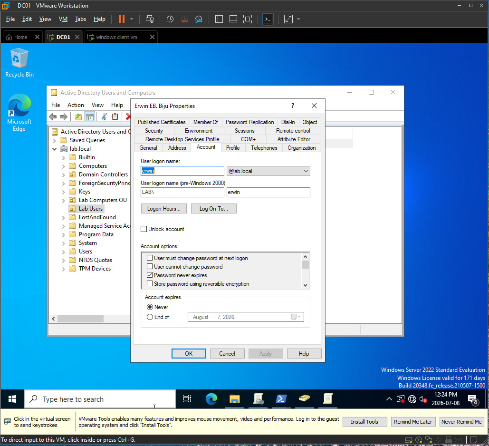
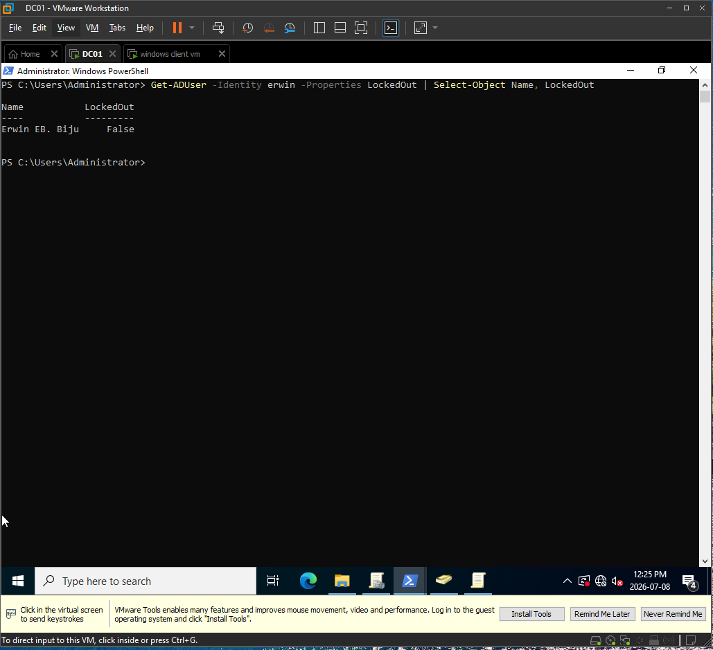
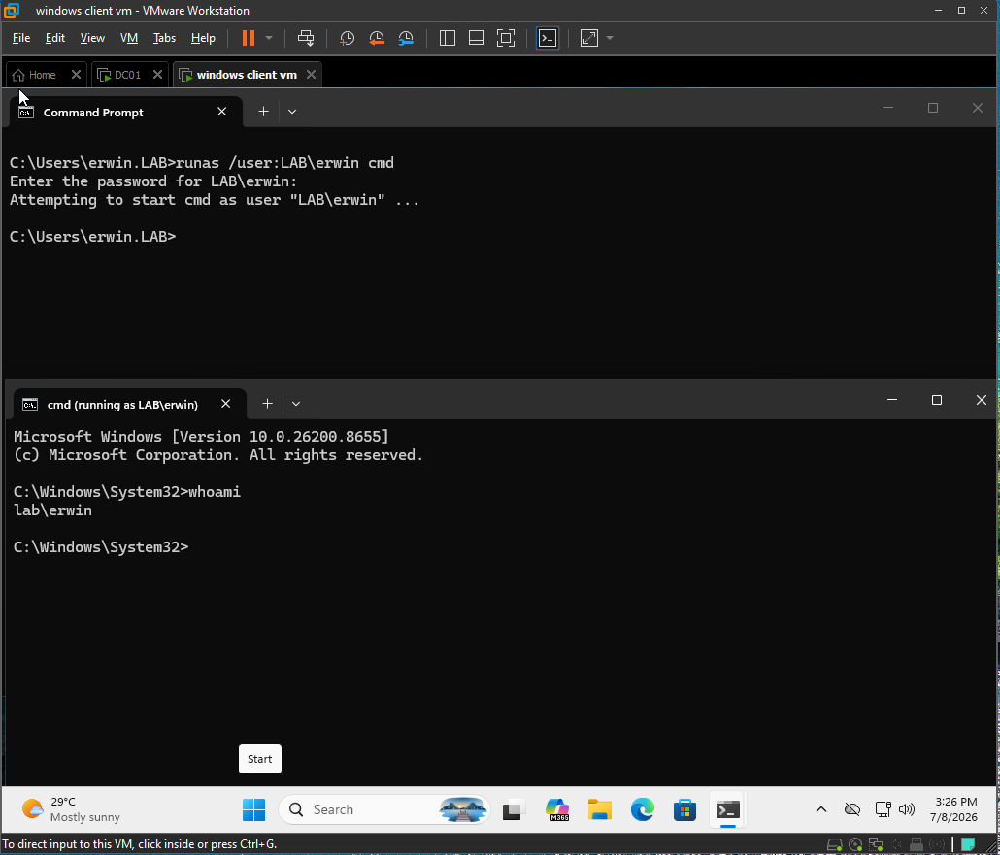
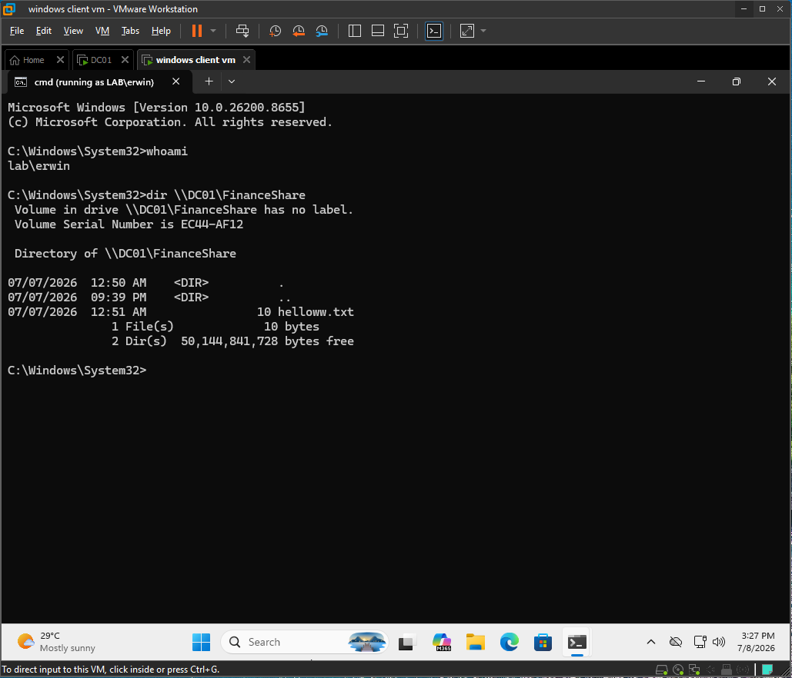

# Ticket 005: User Account Locked Out After Failed Logon Attempts

## Issue Summary

A domain user reported that they could not authenticate successfully after several failed password attempts.

Investigation showed that the Active Directory account `LAB\erwin` was locked out. The account was unlocked in Active Directory Users and Computers, then authentication was tested again successfully.

## Environment

| Item | Details |
|---|---|
| Domain | lab.local |
| NetBIOS | LAB |
| Domain Controller | DC01 |
| DC IP Address | 192.168.40.10 |
| Server OS | Windows Server 2022 |
| Client | DESKTOP-J57NE1D |
| Client OS | Windows 11 Enterprise |
| Affected User | LAB\erwin |
| Related Share | \\DC01\FinanceShare |
| Troubleshooting Layer | Active Directory account status |

## Symptoms

- User could not authenticate successfully.
- User had entered the wrong password multiple times.
- The account was locked out in Active Directory.
- Authentication succeeded again after the account was unlocked.

## Troubleshooting Steps

### 1. Confirmed the domain account lockout policy

I verified the account lockout policy configured for the domain.

The lab policy was configured to lock the account after repeated invalid logon attempts.

---

### 2. Confirmed the account was initially not locked

Before reproducing the issue, I checked the account state with PowerShell.

The account was enabled and `LockedOut` was `False`.

---

### 3. Reproduced failed logon attempts

From the Windows client, I used `runas` to simulate repeated failed authentication attempts for `LAB\erwin`.

After multiple wrong password attempts, the account lockout policy was triggered.

---

### 4. Verified the account was locked in ADUC

I checked the affected user account in Active Directory Users and Computers.

The Account tab showed that the user account was locked out.

---

### 5. Verified the account lockout with PowerShell

I confirmed the lockout state with PowerShell.

PowerShell showed:

`LockedOut : True`

This confirmed the root cause was an Active Directory account lockout.

---

### 6. Confirmed authentication failed while locked

I attempted to authenticate as `LAB\erwin` while the account was locked.

Authentication failed because the account was locked out.

## Root Cause

The account `LAB\erwin` was locked out after repeated failed authentication attempts.

The domain account lockout policy locked the user account after multiple incorrect password attempts. While locked, the user could not authenticate normally, even with the correct password.

## Fix

I unlocked the user account using Active Directory Users and Computers.

Path used:

`Active Directory Users and Computers → LAB\erwin → Properties → Account → Unlock account`

## Verification

### 1. Verified account was no longer locked

After unlocking the account, I checked the account state again with PowerShell.

PowerShell showed:

`LockedOut : False`

---

### 2. Verified successful authentication

I tested authentication again using `runas`.

The authentication succeeded and the new command prompt showed:

`LAB\erwin`

---

### 3. Verified Finance share access

I tested access to the Finance share.

The user could successfully access:

`\\DC01\FinanceShare`

## Interview Explanation

An Active Directory account lockout happens when a user exceeds the allowed number of failed logon attempts defined by the domain account lockout policy.

In this ticket, the user was unable to authenticate because the account was locked out, not because of DNS, Group Policy, share permissions, NTFS permissions, or group membership. I isolated the issue by checking the account status in Active Directory Users and Computers and confirming it with PowerShell.

The fix was to unlock the account in Active Directory. After unlocking, I verified that `LockedOut` changed to `False`, then confirmed the user could authenticate and access the Finance share again.

A key help desk point is that unlocking an account does not mean resetting the password. If the user knows the correct password, unlocking the account may be enough. If the user forgot the password, a password reset would be a separate action.

## Help Desk Notes

- Confirmed the domain account lockout policy.
- Confirmed the user account was initially not locked.
- Reproduced failed authentication attempts.
- Verified account lockout in ADUC.
- Verified account lockout with PowerShell.
- Confirmed authentication failed while locked.
- Unlocked the account in ADUC.
- Verified `LockedOut` changed to `False`.
- Confirmed successful authentication after unlock.
- Confirmed Finance share access after unlock.
- Root cause: user account locked out due to repeated failed logon attempts.
