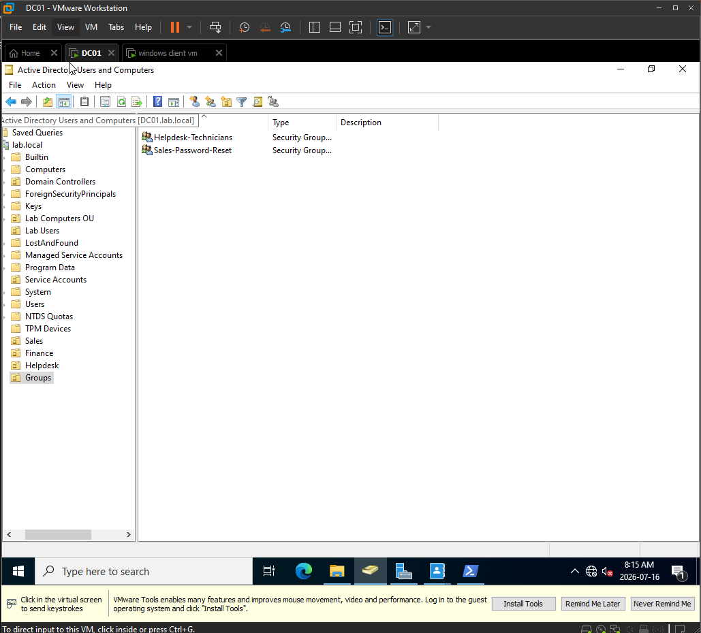
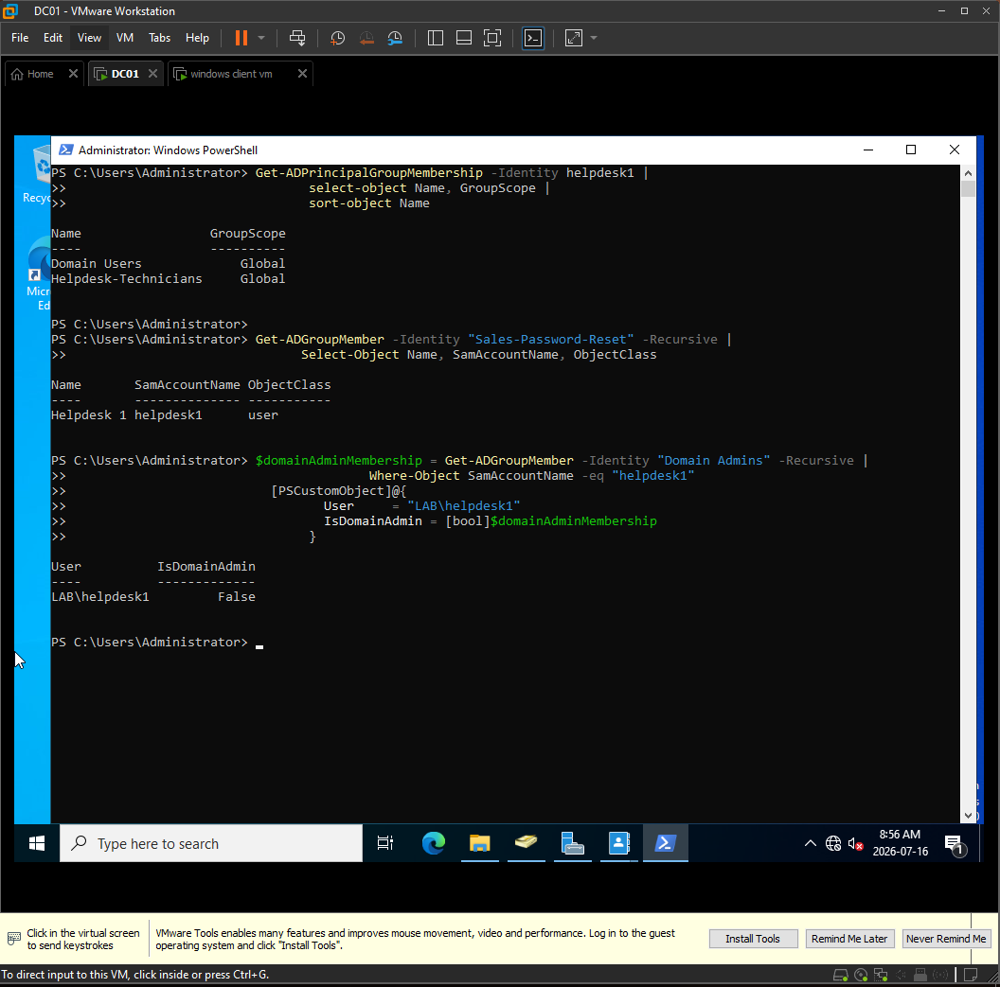
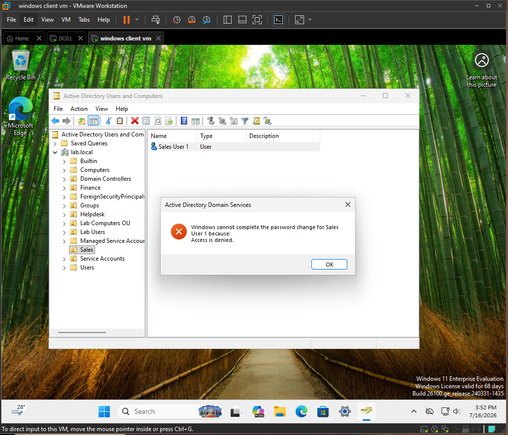
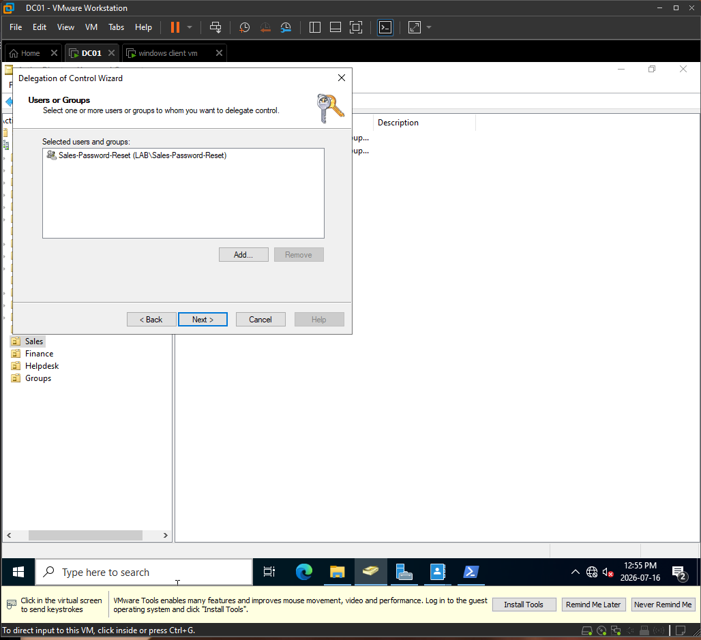
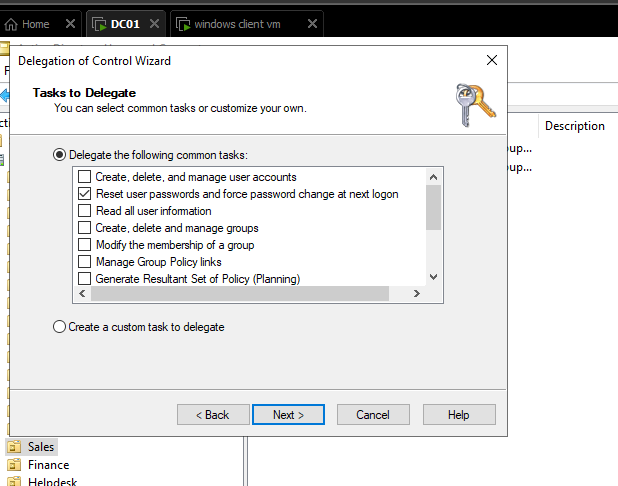
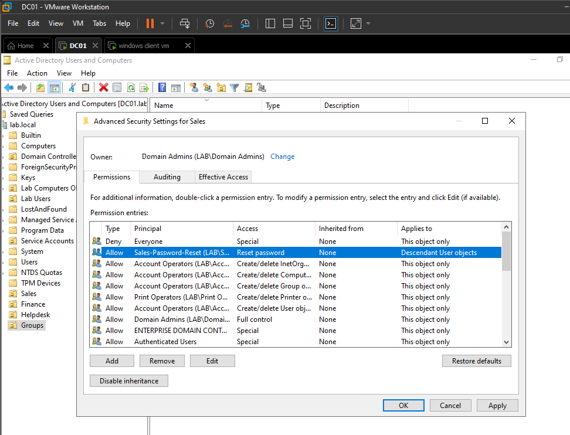
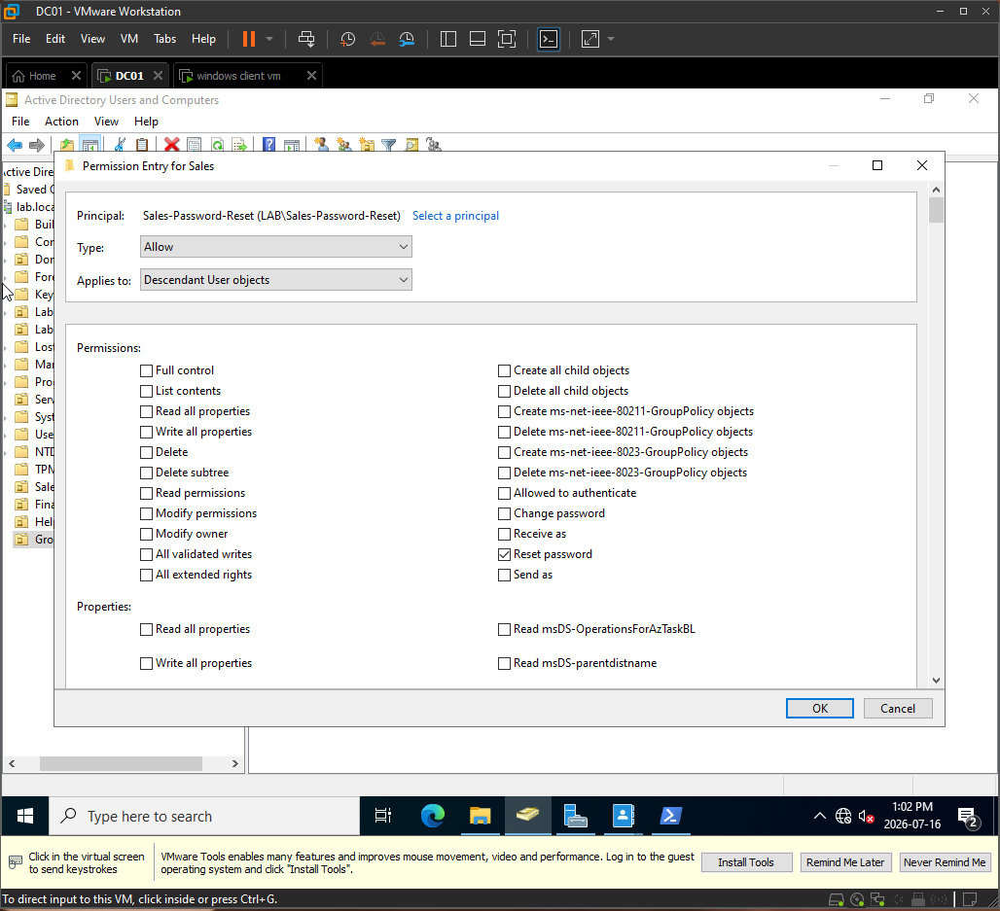
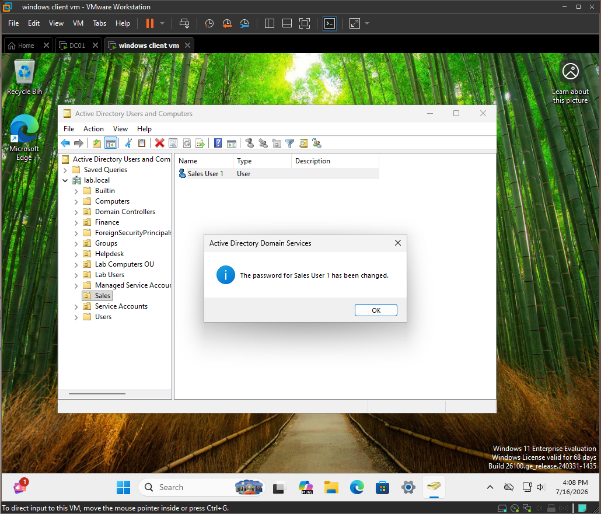
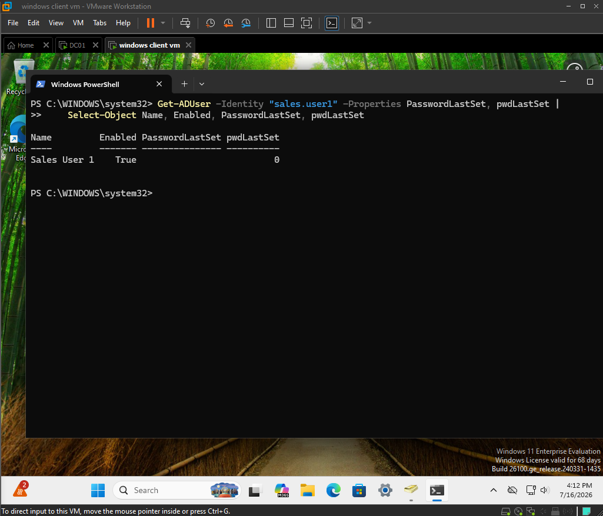
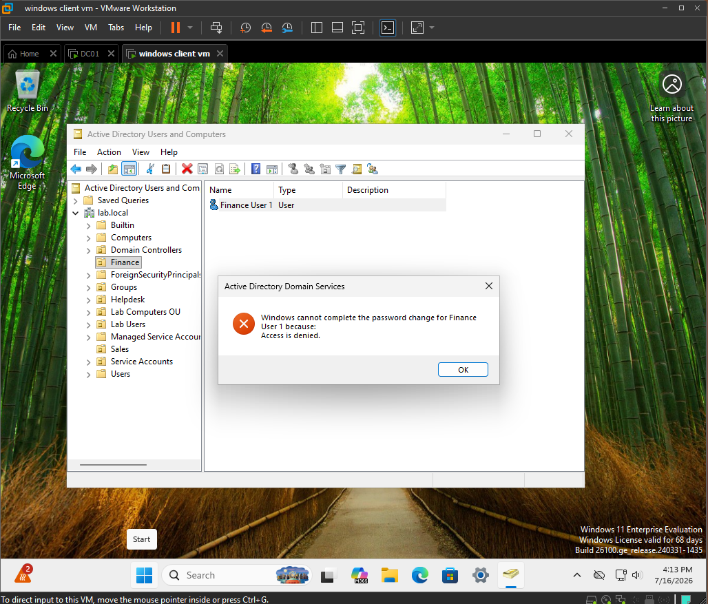

# Ticket 006: Delegate Sales OU Password Reset Permissions to Help Desk

## Issue Summary

Help desk technicians needed permission to reset passwords for users in the Sales OU only.

Investigation showed that the help desk account `LAB\helpdesk1` did not initially have delegated password-reset permission on the Sales OU. Instead of adding the technician to Domain Admins, password-reset access was delegated through a least-privilege group structure.

The account `LAB\helpdesk1` was added to the global group `LAB\Helpdesk-Technicians`, which was nested inside the domain local group `LAB\Sales-Password-Reset`. The `LAB\Sales-Password-Reset` group was then delegated password-reset permission on the Sales OU.

## Environment

| Item | Details |
|---|---|
| Domain | lab.local |
| NetBIOS | LAB |
| Domain Controller | DC01 |
| DC IP Address | 192.168.40.10 |
| Server OS | Windows Server 2022 |
| Client | DESKTOP-J57NE1D |
| Client OS | Windows 11 Enterprise |
| Help Desk User | LAB\helpdesk1 |
| Help Desk Global Group | LAB\Helpdesk-Technicians |
| Delegation Role Group | LAB\Sales-Password-Reset |
| Target OU | Sales |
| Positive Test User | LAB\sales.user1 |
| Negative Test User | LAB\finance.user1 |
| Troubleshooting Layer | Active Directory delegation / OU permissions |

## Symptoms

- Help desk technicians needed to reset passwords for Sales users.
- Help desk technicians should not be Domain Admins.
- `LAB\helpdesk1` could not reset the password for `LAB\sales.user1` before delegation.
- Active Directory Users and Computers returned **Access is denied** before the permission was delegated.
- The required permission needed to be scoped only to user accounts inside the Sales OU.

## Troubleshooting Steps

### 1. Confirmed the required Active Directory objects and groups

I confirmed the required OUs, users, and security groups in Active Directory Users and Computers.

The following OUs were used:

```text
Sales
Finance
Helpdesk
Groups
```

The following users were used:

```text
LAB\sales.user1
LAB\finance.user1
LAB\helpdesk1
```

The following groups were used:

```text
LAB\Helpdesk-Technicians
LAB\Sales-Password-Reset
```

The intended group structure was:

```text
LAB\helpdesk1
→ LAB\Helpdesk-Technicians
→ LAB\Sales-Password-Reset
```



---

### 2. Verified help desk group membership and Domain Admin status

I used PowerShell to verify that `LAB\helpdesk1` was part of the help desk group structure and was not a Domain Admin.



The expected result showed that `LAB\helpdesk1` received access through the delegated group structure and that `IsDomainAdmin` was `False`.

This confirmed that the account was not overprivileged.

---

### 3. Reproduced password reset failure before delegation

From the Windows client, I signed in as `LAB\helpdesk1` and opened Active Directory Users and Computers.

I attempted to reset the password for:

```text
LAB\sales.user1
```

Before delegation, the password reset failed with **Access is denied**.



This confirmed that `LAB\helpdesk1` did not initially have permission to reset passwords for Sales users.

---

### 4. Selected the delegated group in the Delegation of Control Wizard

On `DC01`, I opened Active Directory Users and Computers using an administrative account.

I right-clicked the Sales OU and started the Delegation of Control Wizard.

Path used:

```text
Active Directory Users and Computers → Sales OU → Right-click → Delegate Control
```

I selected the domain local group:

```text
LAB\Sales-Password-Reset
```



The permission was delegated to the group, not directly to the individual technician account.

---

### 5. Selected the password reset delegation task

In the Delegation of Control Wizard, I selected the following common task:

```text
Reset user passwords and force password change at next logon
```



No broad permissions were granted.

The following were not assigned:

```text
Domain Admin membership
Full Control
User creation rights
User deletion rights
Group management rights
```

---

### 6. Verified the delegated permission in the Sales OU ACL

I enabled Advanced Features in Active Directory Users and Computers.

Path used:

```text
View → Advanced Features
```

Then I checked the Sales OU security settings.

Path used:

```text
Sales OU → Properties → Security → Advanced
```

I confirmed that `LAB\Sales-Password-Reset` appeared in the Sales OU permissions.



This showed that the Delegation of Control Wizard wrote a permission entry into the Sales OU ACL.

---

### 7. Reviewed the delegated permission details

I inspected the permission entry for:

```text
LAB\Sales-Password-Reset
```



The permission was limited to password-reset-related access for user objects under the Sales OU.

This confirmed that the group was not granted Full Control over the OU.

---

### 8. Verified successful password reset for a Sales user

After delegation, I tested the password reset again from the Windows client as:

```text
LAB\helpdesk1
```

I reset the password for:

```text
LAB\sales.user1
```

The password reset succeeded.



This confirmed that the delegated permission worked for users inside the Sales OU.

---

### 9. Verified the Sales user password state with PowerShell

I verified the password state for `LAB\sales.user1` with PowerShell.



PowerShell showed:

```text
pwdLastSet : 0
```

A `pwdLastSet` value of `0` means the user must change their password at next logon.

This confirmed that the password reset and forced password change setting were applied successfully.

---

### 10. Confirmed password reset failed outside the Sales OU

I tested the scope of the delegation by attempting to reset the password for:

```text
LAB\finance.user1
```

The test was performed as:

```text
LAB\helpdesk1
```

The password reset failed with **Access is denied**.



This confirmed that the delegated permission applied only to the Sales OU and did not apply to users in the Finance OU.

## Root Cause

The help desk account `LAB\helpdesk1` did not have delegated password-reset permission on the Sales OU.

Active Directory correctly denied the password reset before delegation because the account was not authorized to reset passwords for users in the Sales OU.

The correct fix was not to add the technician to Domain Admins. The correct fix was to delegate the specific password-reset permission on the Sales OU.

## Fix

I created and used a least-privilege delegation structure:

```text
LAB\helpdesk1
→ LAB\Helpdesk-Technicians
→ LAB\Sales-Password-Reset
→ Password reset permission on the Sales OU
```

The Delegation of Control Wizard was used on the Sales OU.

Delegated task selected:

```text
Reset user passwords and force password change at next logon
```

The permission was assigned to:

```text
LAB\Sales-Password-Reset
```

This allowed members of the delegated group to reset passwords for users in the Sales OU only.

## Verification

### 1. Verified help desk account was not a Domain Admin

I confirmed that `LAB\helpdesk1` was not a member of Domain Admins.


PowerShell showed that `IsDomainAdmin` was `False`.

---

### 2. Verified successful password reset for Sales user

I tested password reset for `LAB\sales.user1` from the client as `LAB\helpdesk1`.


The reset succeeded because `sales.user1` is located inside the Sales OU.

---

### 3. Verified password change required at next logon

I checked the account state with PowerShell.


PowerShell showed:

```text
pwdLastSet : 0
```

This confirmed that `sales.user1` must change the password at next logon.

---

### 4. Verified password reset failed for Finance user

I attempted to reset the password for `LAB\finance.user1` as `LAB\helpdesk1`.


The reset failed with **Access is denied** because `finance.user1` is outside the Sales OU.

## Explanation

Active Directory delegation allows specific administrative tasks to be assigned without granting full administrative control.

In this ticket, the help desk technician needed only one task:

```text
Reset passwords for users in the Sales OU
```

The technician did not need:

```text
Domain Admin rights
Full Control over the OU
Permission to create users
Permission to delete users
Permission to reset passwords in other OUs
```

The Delegation of Control Wizard wrote an Access Control Entry into the Sales OU ACL.

```text
ACL = Access Control List
ACE = Access Control Entry
```

When `LAB\helpdesk1` attempts to reset a password, the domain controller checks the user’s security token and the target user’s permissions.

The domain controller checks:

```text
Is helpdesk1 a member of a group with password reset permission?
Does the permission apply to the target user object?
Is the target user inside the Sales OU?
```

For `LAB\sales.user1`, the reset succeeds because the user is inside the Sales OU.

For `LAB\finance.user1`, the reset fails because the user is outside the Sales OU.

This proves that the delegation follows least privilege.

## Help Desk Notes

- Confirmed the required Sales, Finance, Helpdesk, and Groups OUs.
- Confirmed the test users `sales.user1`, `finance.user1`, and `helpdesk1`.
- Created the help desk global group `Helpdesk-Technicians`.
- Created the domain local delegation group `Sales-Password-Reset`.
- Added `helpdesk1` to `Helpdesk-Technicians`.
- Nested `Helpdesk-Technicians` inside `Sales-Password-Reset`.
- Confirmed `helpdesk1` was not a Domain Admin.
- Reproduced the password reset failure before delegation.
- Delegated password reset permission on the Sales OU.
- Verified the delegated permission in the Sales OU ACL.
- Confirmed Sales password reset succeeded.
- Confirmed `pwdLastSet` was `0` after forcing password change at next logon.
- Confirmed Finance password reset failed with Access is denied.
- Root cause: missing delegated password-reset permission on the Sales OU.
- Fix: delegated least-privilege password-reset rights to `LAB\Sales-Password-Reset`.
