# Ticket 008: Implement Fine-Grained Password Policy for Privileged and Service Accounts

## Issue Summary

Security requested a stricter password policy for privileged administrator accounts and service accounts without changing the password policy for regular staff.

Investigation showed that a normal GPO-based password policy would not meet this requirement because Active Directory domains use one default domain password policy for domain users by default. Linking a separate password-policy GPO to an OU does not create a separate password policy for only the users in that OU.

To meet the requirement, I created a Fine-Grained Password Policy using a Password Settings Object in Active Directory Administrative Center. The new policy was applied to `Domain Admins` and `Privileged-Service-Accounts`, while regular user `LAB\erwin` continued using the default domain password policy.

## Environment

| Item | Details |
|---|---|
| Domain | lab.local |
| NetBIOS | LAB |
| Domain Controller | DC01 |
| DC IP Address | 192.168.40.10 |
| Server OS | Windows Server 2022 |
| Client | DESKTOP-J57NE1D |
| Client OS | Windows 11 Enterprise |
| Regular User | LAB\erwin |
| Service Account | LAB\svc_backup |
| Target Groups | Domain Admins, Privileged-Service-Accounts |
| Related Object | Privileged-Accounts-Password-Policy |
| Troubleshooting Layer | Active Directory password policy management |

## Symptoms

- Security required stronger password rules for privileged administrator accounts.
- Security required stronger password rules for service accounts.
- Regular users needed to keep the existing domain password policy.
- A separate OU-linked password-policy GPO would not correctly apply different domain password settings.
- A Password Settings Object was required to target selected users or global security groups.

## Troubleshooting Steps

### 1. Confirmed the default domain password policy

I verified the current domain-wide password policy before making any changes.

Command used:

```powershell
Get-ADDefaultDomainPasswordPolicy 
```

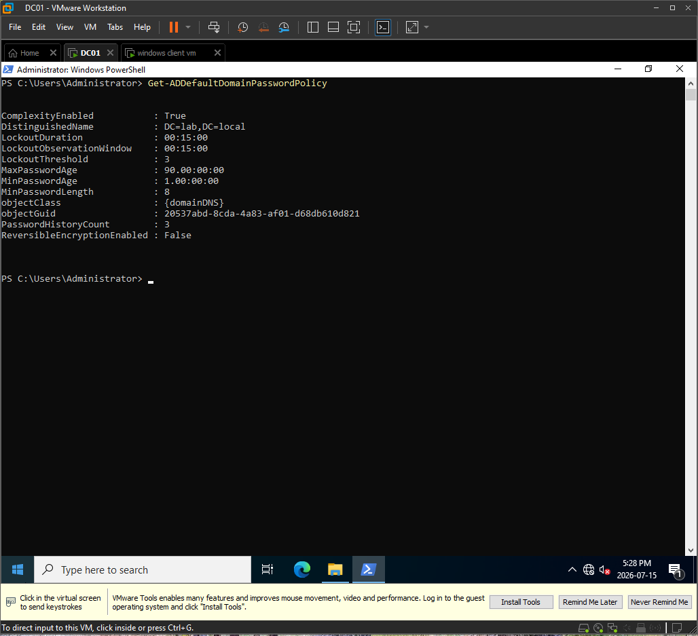

This confirmed the baseline password policy that regular domain users were already receiving.

---

### 2. Confirmed the service account existed

I confirmed that the service account `LAB\svc_backup` existed in Active Directory Users and Computers.

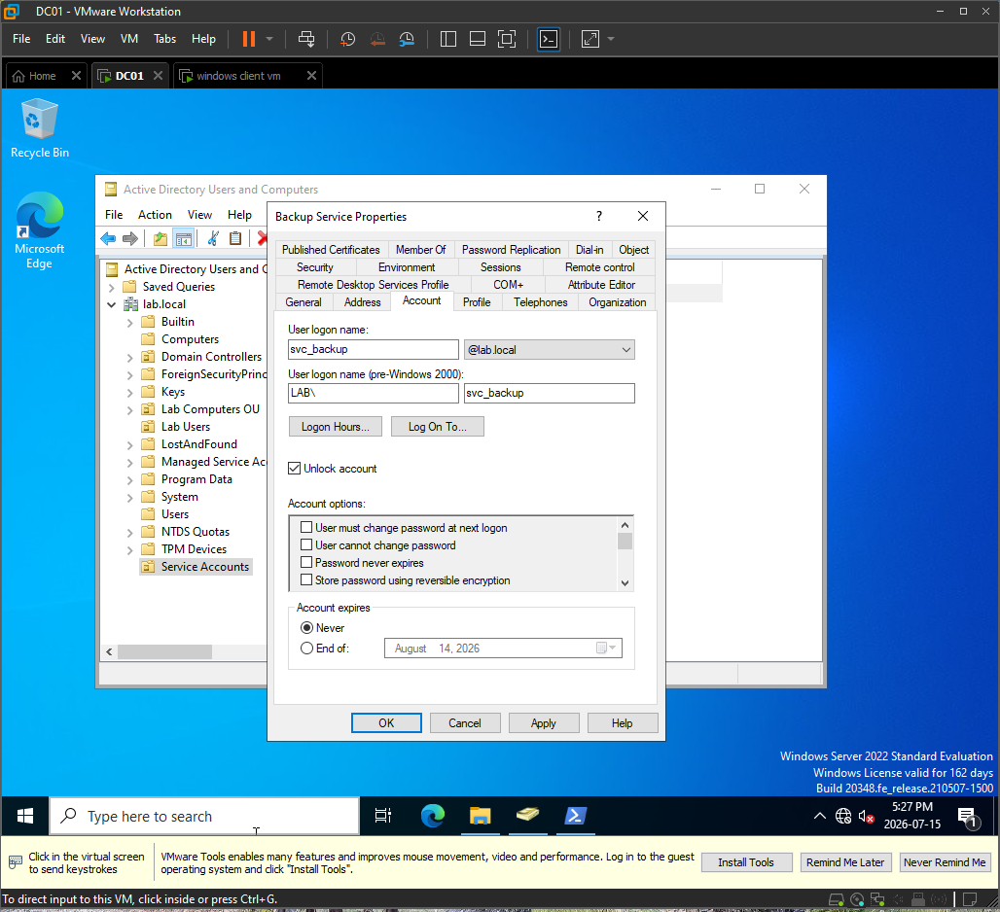

This account was used as the test service account for the stricter password policy.

---

### 3. Created the privileged service accounts group

I created a new Active Directory security group named `Privileged-Service-Accounts`.

Group configuration:

| Setting | Value |
|---|---|
| Group name | Privileged-Service-Accounts |
| Group scope | Global |
| Group type | Security |

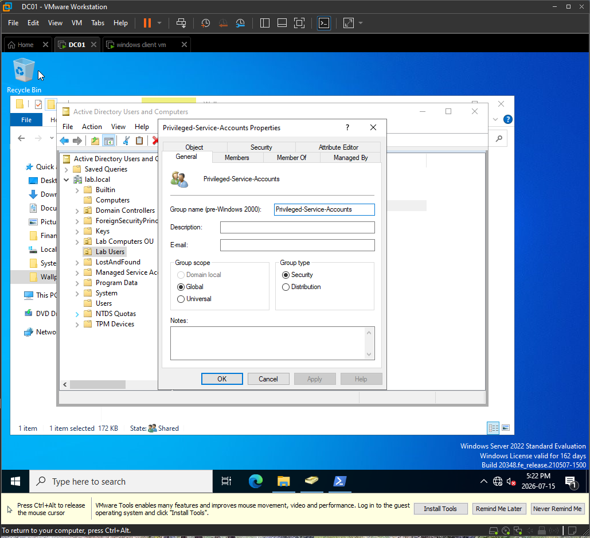

The group was created as a Global Security group because Password Settings Objects can apply to users and global security groups.

This group is not being used as a GPO target. A GPO is linked to a site, domain, or OU. A Password Settings Object is different because it can be assigned directly to users or global security groups.

---

### 4. Added the service account to the privileged service accounts group

I added `LAB\svc_backup` as a member of the `Privileged-Service-Accounts` group.

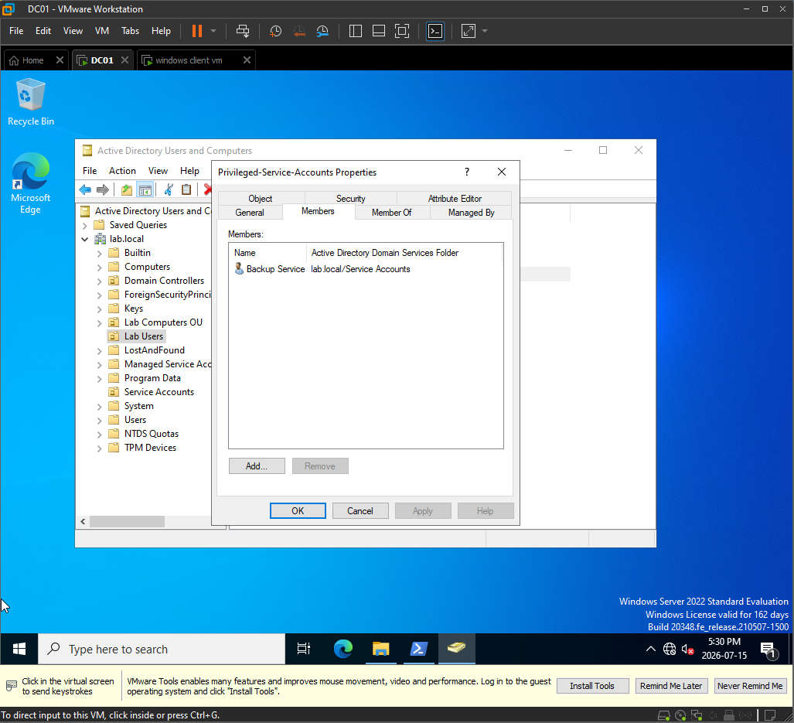

This allowed the service account to receive the Fine-Grained Password Policy through group membership.

---

### 5. Opened the Password Settings Container

I opened Active Directory Administrative Center and navigated to the Password Settings Container.

Path used:

```text
Active Directory Administrative Center → lab (local) → System → Password Settings Container
```

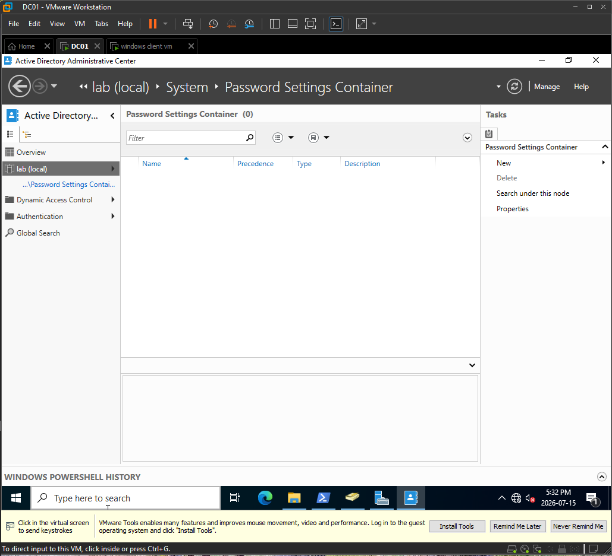

This is where Fine-Grained Password Policies are created and stored in Active Directory.

---

### 6. Created the Password Settings Object

I created a new Password Settings Object named `Privileged-Accounts-Password-Policy`.

Initial PSO settings:

| Setting | Value |
|---|---|
| Name | Privileged-Accounts-Password-Policy |
| Precedence | 10 |
| Minimum password length | 14 |
| Maximum password age | 30 days |
| Minimum password age | 1 day |
| Password history | 24 passwords |
| Complexity | Enabled |
| Reversible encryption | Disabled |

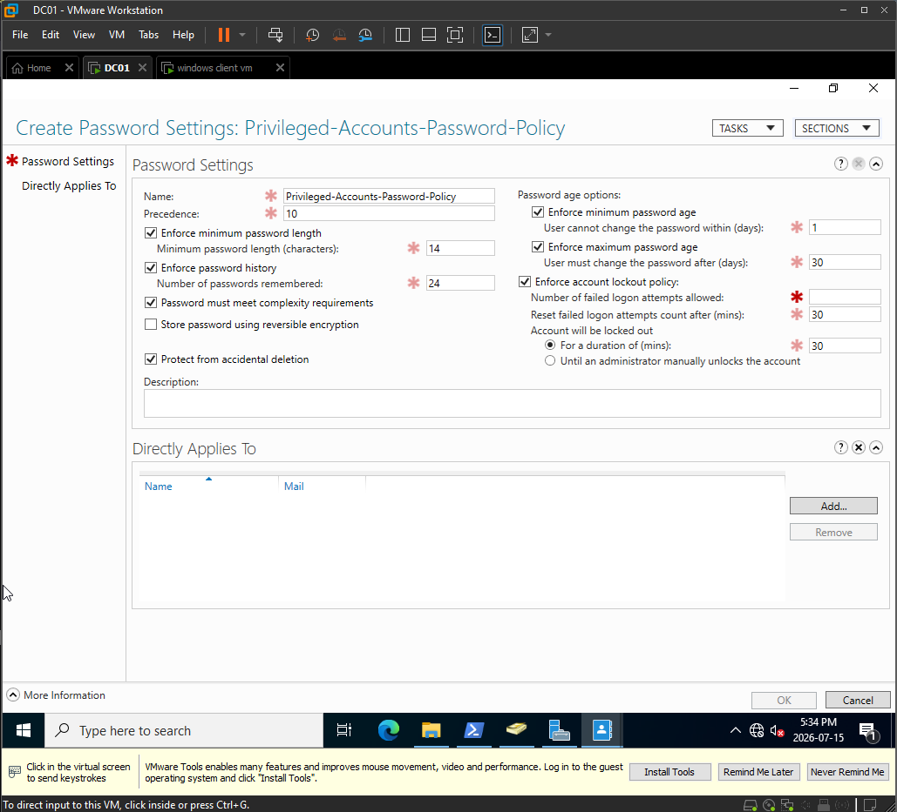

The PSO was configured with stronger password settings than the default domain password policy.

---

### 7. Configured stricter account lockout settings

I configured the account lockout settings in the Password Settings Object.

Lockout settings:

| Setting | Value |
|---|---|
| Number of failed logon attempts allowed | 3 |
| Reset failed logon attempts count after | 30 minutes |
| Account will be locked out for | 30 minutes |

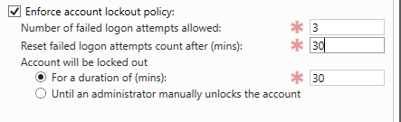

These settings make privileged and service accounts lock out faster than regular accounts after repeated failed authentication attempts.

---

### 8. Assigned the PSO to the target groups

I assigned the Password Settings Object to the required target groups.

Groups added under `Directly Applies To`:

- `Domain Admins`
- `Privileged-Service-Accounts`

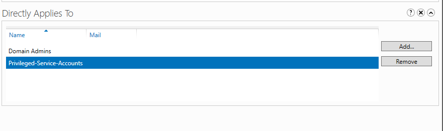

This means members of those groups receive the stricter password policy.

The PSO was assigned to groups, but this was not GPO security filtering. Password Settings Objects are not linked to OUs like regular GPOs.

---

### 9. Confirmed the PSO was created

I confirmed that `Privileged-Accounts-Password-Policy` appeared in the Password Settings Container.

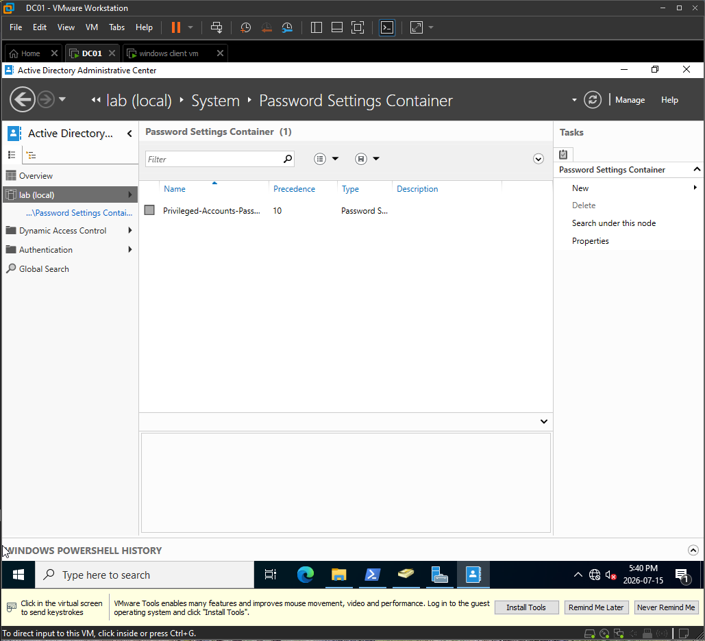

This confirmed that the Fine-Grained Password Policy was successfully created in Active Directory.

---

### 10. Verified the PSO settings with PowerShell

I verified the Password Settings Object using PowerShell.

Command used:

```powershell
Get-ADFineGrainedPasswordPolicy -Identity "Privileged-Accounts-Password-Policy" 
```

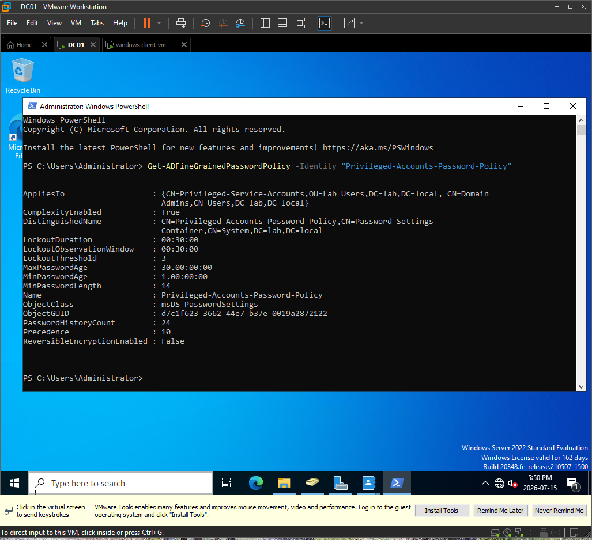

The PowerShell output confirmed the configured settings, including the minimum password length, maximum password age, password history, lockout threshold, and assigned target groups.

## Root Cause

The security requirement could not be met by creating a normal OU-linked GPO.

In Active Directory, the default domain password and account lockout policy applies at the domain level. Linking another password policy GPO to an OU does not create a separate password policy for domain users in that OU.

To apply different password settings to selected privileged accounts, Active Directory requires a Fine-Grained Password Policy. Fine-Grained Password Policies are created as Password Settings Objects and can be assigned directly to user accounts or global security groups.

## Fix

I created a Fine-Grained Password Policy using Active Directory Administrative Center.

The Password Settings Object was named:

```text
Privileged-Accounts-Password-Policy
```

The policy was configured with stricter password and lockout settings:

- Minimum password length: 14 characters
- Maximum password age: 30 days
- Minimum password age: 1 day
- Password history: 24 passwords
- Password complexity enabled
- Reversible encryption disabled
- Lockout threshold: 3 failed attempts
- Lockout duration: 30 minutes
- Reset failed attempt counter after: 30 minutes
- Precedence: 10

The PSO was assigned to:

- `Domain Admins`
- `Privileged-Service-Accounts`


## Verification

### 1. Verified the Domain Admin resultant password policy

I verified that a domain administrator received the new Fine-Grained Password Policy.

Command used:

```powershell
Get-ADUserResultantPasswordPolicy -Identity Administrator 
```


The resultant password policy showed `Privileged-Accounts-Password-Policy`, confirming that members of `Domain Admins` received the stricter policy.

---

### 2. Verified the service account resultant password policy

I verified that `LAB\svc_backup` received the new Fine-Grained Password Policy.

Command used:

```powershell
Get-ADUserResultantPasswordPolicy -Identity svc_backup 
```

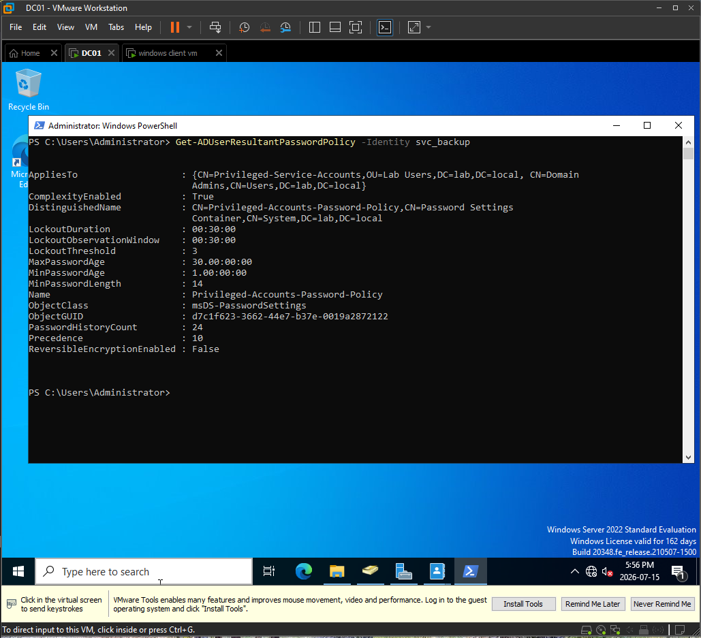

The resultant password policy showed `Privileged-Accounts-Password-Policy`, confirming that the service account received the stricter policy through membership in `Privileged-Service-Accounts`.

---

### 3. Verified the regular user did not receive the PSO

I checked the resultant password policy for regular user `LAB\erwin`.

Command used:

```powershell
Get-ADUserResultantPasswordPolicy -Identity erwin


}
```

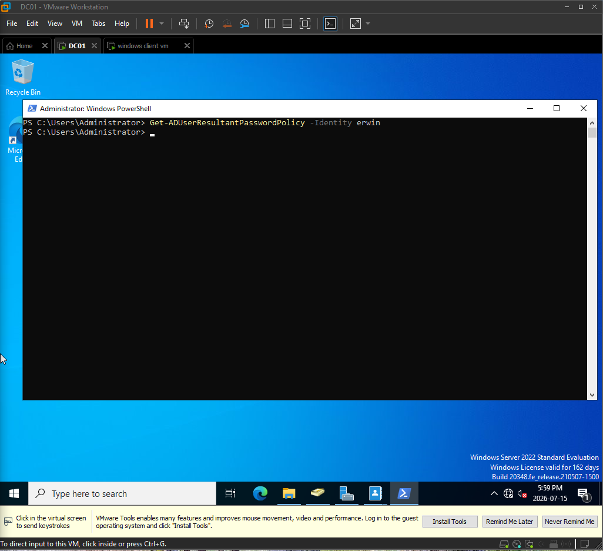

No Fine-Grained Password Policy applied to `LAB\erwin`, which confirmed that the regular user was not affected by the new privileged account policy.

---

### 4. Verified the default domain policy remained unchanged

I checked the default domain password policy again.

Command used:

```powershell
Get-ADDefaultDomainPasswordPolicy 
```

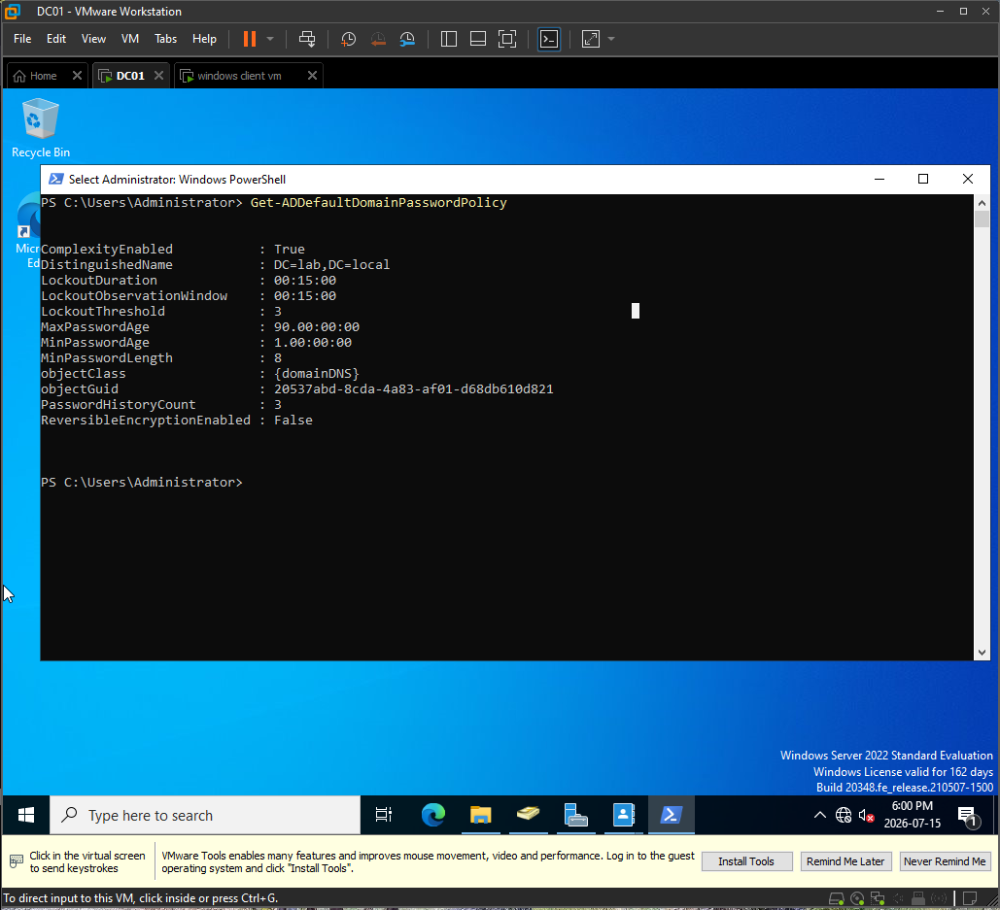

The default domain password policy remained unchanged, confirming that regular staff accounts continued using the original domain policy.

## Explanation

A normal GPO is linked to a site, domain, or OU. A Password Settings Object is different. It is not linked to an OU and it is not applied like a normal GPO.

A Password Settings Object can apply directly to:

- User accounts
- Global security groups

In this ticket, the stricter policy was assigned to `Domain Admins` and `Privileged-Service-Accounts`.

The service account `LAB\svc_backup` received the policy because it was a member of `Privileged-Service-Accounts`.

The regular user `LAB\erwin` did not receive the PSO, so that account continued using the default domain password policy.

This issue was not caused by user permissions, DNS, Group Policy processing, or account lockout. It was a password policy design limitation. I fixed it by using a Fine-Grained Password Policy, which is the correct Active Directory method for applying different password rules to selected users or global security groups.

## Help Desk Notes

- Confirmed the existing default domain password policy.
- Confirmed the `LAB\svc_backup` service account existed.
- Created the `Privileged-Service-Accounts` global security group.
- Added `LAB\svc_backup` to `Privileged-Service-Accounts`.
- Opened the Password Settings Container in Active Directory Administrative Center.
- Created `Privileged-Accounts-Password-Policy`.
- Configured a 14-character minimum password length.
- Configured a 30-day maximum password age.
- Configured a 24-password history.
- Enabled password complexity.
- Disabled reversible encryption.
- Configured a 3-attempt lockout threshold.
- Configured a 30-minute lockout duration.
- Assigned the PSO to `Domain Admins`.
- Assigned the PSO to `Privileged-Service-Accounts`.
- Verified the PSO settings with PowerShell.
- Verified a domain administrator received the PSO.
- Verified `LAB\svc_backup` received the PSO.
- Verified `LAB\erwin` did not receive the PSO.
- Confirmed the default domain password policy remained unchanged.
- Root cause: a normal OU-linked GPO cannot create separate domain password policies for different user groups.
